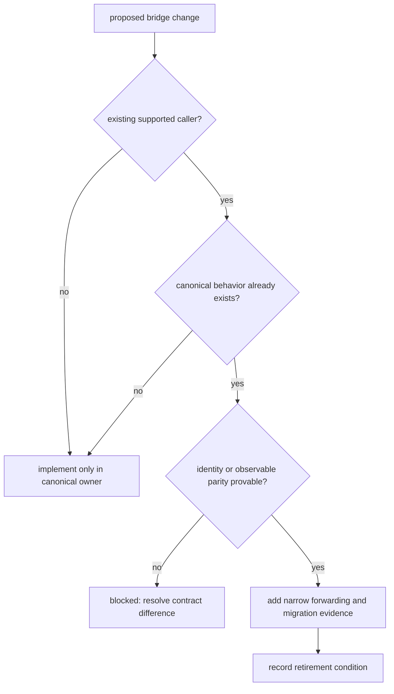

# Extensibility model

`agentic-proteins` extends only by preserving an established caller while the
canonical owner evolves. New execution, provider, state, transport, or
scientific behavior belongs in Runtime or the package that owns its meaning.

## Admission decision

| Capability | Canonical owner | Permitted compatibility work |
| --- | --- | --- |
| CLI command or HTTP route | Runtime interfaces | preserve a named legacy transport contract |
| lifecycle, checkpoint, workspace, or artifact | Runtime runs and state | forward an established import or request path |
| agent, planner, verifier, or tool | Runtime execution | expose a narrow alias for a proven caller |
| provider or capability policy | Runtime providers | preserve names and capability queries without local selection logic |
| scientific model or transformation | Core | no bridge implementation |
| evidence model or source resolution | Knowledge | no bridge implementation |
| ranking or recommendation policy | Intelligence | no bridge implementation |
| assay design, readiness, or outcome | Lab | no bridge implementation |

## Forwarding contract

A compatibility addition records the caller, legacy path, canonical path,
identity or behavioral comparison, optional dependencies, failure parity, and
removal condition. Prefer explicit imports and `__all__` for small surfaces.
Wildcard forwarding is acceptable only when the contract intentionally mirrors
the canonical module and export-drift tests protect it.

Wrappers require exceptional scrutiny. Changing exceptions, defaults, status,
serialization, credentials, provider selection, or artifact fields creates
bridge-owned behavior even if the happy-path result looks similar.

## Rejection signals

- implementation exists in both bridge and Runtime;
- a provider is registered only under the legacy namespace;
- CLI or HTTP validation differs from Runtime;
- `execution` and `orchestration` expose different objects for one promise;
- a bridge-only option has no canonical destination;
- compatibility is justified by hypothetical users rather than an observed
  caller; or
- removal depends on a date rather than caller and parity evidence.

An extension is complete only when the canonical documentation leads, the
legacy path compares directly with it, dependency direction remains one-way,
and the retirement budget becomes no worse.
