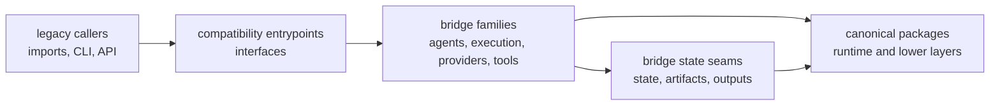

# Architecture

`agentic-proteins` architecture is the map of a shrinking compatibility
bridge. The point of this section is not to admire the old structure. The point
is to show exactly how legacy entrypoints are kept alive while canonical
ownership already lives elsewhere.

## What This Diagram Is Saying

- readers should be able to separate preserved entrypoints from canonical
  ownership in a few seconds
- the bridge still has real structure, but that structure exists to forward,
  constrain, and expose migration proof rather than reclaim authority
- if a module starts to look like the only place behavior can live, the package
  is drifting back into permanence

## Start With

- open [Execution Model](https://bijux.io/bijux-proteomics/02-agentic-proteins/architecture/execution-model/)
  when you need to follow a legacy import, CLI call, or API request until it
  reaches canonical runtime ownership
- open [Integration Seams](https://bijux.io/bijux-proteomics/02-agentic-proteins/architecture/integration-seams/)
  when a change risks moving real authority back into the compatibility layer
- open [Module Map](https://bijux.io/bijux-proteomics/02-agentic-proteins/architecture/module-map/)
  when you already know the question and need the owning files quickly

## Reading Lenses

- [Module Map](https://bijux.io/bijux-proteomics/02-agentic-proteins/architecture/module-map/)
  for the named bridge families: interfaces, agents, execution, providers,
  state, and tools
- [Dependency Direction](https://bijux.io/bijux-proteomics/02-agentic-proteins/architecture/dependency-direction/)
  for the rule that dependencies should keep pointing toward canonical packages,
  not away from them
- [State and Persistence](https://bijux.io/bijux-proteomics/02-agentic-proteins/architecture/state-and-persistence/)
  and [Error Model](https://bijux.io/bijux-proteomics/02-agentic-proteins/architecture/error-model/)
  for the surfaces most likely to trap accidental permanence
- [Architecture Risks](https://bijux.io/bijux-proteomics/02-agentic-proteins/architecture/architecture-risks/)
  for the failure modes that matter more than stylistic purity

## Fast Proof Points

- `src/agentic_proteins/interfaces/` for preserved CLI, HTTP, and
  structure-report entrypoints
- `src/agentic_proteins/agents/`, `execution/`, and `tools/` for the bridge
  families most exposed to accidental shadow-ownership drift
- `src/agentic_proteins/providers/` and `state/` for adapter selection and
  compatibility state that still survive for migration review

## Boundary Test

If a reviewer cannot point to the forwarding seam and the canonical owner in the
same explanation, the architecture is still hiding the real system.
