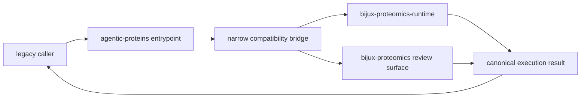
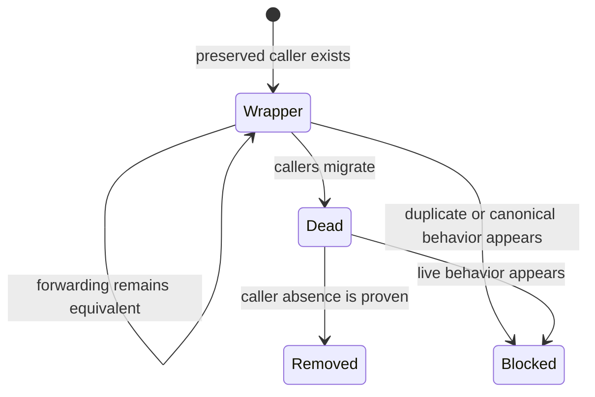

# Compatibility bridge architecture

`agentic-proteins` preserves historical Python, command-line, and HTTP entry
routes while canonical execution lives in `bijux-proteomics-runtime`. It is a
compatibility distribution, not an alternate runtime. Its architecture is
therefore judged by faithful forwarding, visible ownership, and safe removal.

The bridge may preserve a name, import location, call signature, patch seam, or
transport entrypoint. It may not create a second implementation of the
behavior behind that surface.

## Ownership map

| Legacy family | Preserved surface | Canonical owner |
| --- | --- | --- |
| `interfaces.cli` | command invocation | Runtime API CLI |
| `interfaces.http` | application, middleware, routes, schemas | Runtime API |
| `agents` | agent contracts, planning, analysis, verification | Runtime execution agents |
| `execution` and `orchestration` | compilation, evaluation, runs, telemetry | Runtime execution and runs |
| `providers` | capability, selection, local and remote providers | Runtime providers |
| `state` | request, context, lifecycle, snapshots, workspace | Runtime runs, state, and support |
| `tools` | tool contracts, catalog, heuristic tools | Runtime execution tools |
| `interfaces.structure_reports` | structure review rendering | Core review surface |

The exact module-to-owner mapping is governed by the
[compatibility inventory](../../09-bijux-proteomics-runtime/migration-ledger/agentic-proteins-compatibility-inventory.md)
and the [canonical migration guide](../../09-bijux-proteomics-runtime/migration-ledger/agentic-proteins-canonical-migration-guide.md).
Those generated records take precedence over family-level summaries when a
single module has a more specific owner.

## Module dispositions

Every compatibility module has one permitted disposition:

- **wrapper** — forwards an existing surface to a declared canonical owner;
- **dead** — contains no live behavior and remains only until caller absence is
  demonstrated and the namespace can be removed.

`canonical` and `duplicate` are forbidden dispositions. Either would mean the
compatibility package had regained product authority. The governed inventory
currently classifies 112 modules as wrappers and five as dead, with no
canonical or duplicate modules and no bridge-to-bridge import hops.

## One-way dependencies

Dependencies point from legacy names toward current owners. Canonical packages
never import the bridge to obtain product behavior. A bridge may adapt an old
signature to a current signature only when the transformation is explicit,
covered by equivalence tests, and leaves policy with the canonical owner.

[Dependency direction](dependency-direction.md) defines the import rule;
[integration seams](integration-seams.md) identifies allowable adapters.

## Preserved equivalence

Compatibility is broader than import success. Depending on the surface, the
bridge must preserve:

- importability and exported symbol identity;
- argument defaults, accepted values, and failure behavior;
- CLI command names, exit status, standard streams, and artifact locations;
- HTTP methods, paths, status codes, schemas, and error envelopes;
- configuration precedence and environment interpretation;
- serialization, state transitions, replay behavior, and observable side
  effects.

An intentional difference is a migration event, not a hidden implementation
detail. It needs a declared replacement, release communication, and evidence
that callers can move safely.

## State and failure boundaries

The bridge does not own a parallel persistence model. Legacy state types route
to Runtime state or run contracts, and persisted artifacts remain governed by
their canonical schemas. Likewise, the bridge preserves canonical refusals and
failures instead of converting them into legacy-shaped success.

[State and persistence](state-and-persistence.md) covers durable compatibility;
[error model](error-model.md) covers exception and refusal equivalence.

## Removal architecture

Removal starts with evidence, not deletion. A dead module can disappear only
after repository consumers, published entrypoints, documentation, migration
ledgers, and supported external contracts no longer require it. Wrapper removal
also requires a canonical replacement and an announced compatibility boundary.

[Architecture risks](architecture-risks.md) covers shadow ownership, silent
translation, stale ledgers, and premature removal. [Module map](module-map.md)
provides the source-level routes through the bridge.
