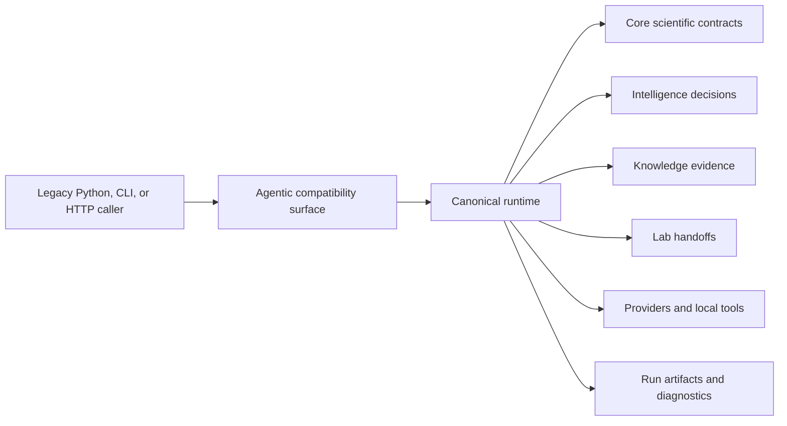

# Integration Seams

Agentic Proteins has one governing seam: a legacy caller enters through the
`agentic_proteins` namespace and execution continues in
`bijux_proteomics_runtime`. The bridge preserves supported names and call
contracts; it does not own a second lifecycle, provider registry, workspace, or
HTTP implementation.

## Seam contracts

| Seam | Agentic obligation | Neighbor obligation |
| --- | --- | --- |
| Package root | Forward the four supported facade exports without eager runtime side effects | Runtime preserves their documented contracts or publishes a migration |
| CLI and HTTP | Preserve accepted routes, command behavior, schemas, and error envelopes while forwarding | Runtime owns implementation, lifecycle state, and new surface design |
| Execution and orchestration aliases | Resolve legacy module paths to one runtime behavior | Runtime keeps run, graph, artifact, telemetry, and validation semantics coherent |
| Agent and tool aliases | Preserve named contracts and catalogs still covered by compatibility policy | Runtime owns planning, coordination, verification, tool execution, and registration |
| Provider aliases | Preserve supported provider names and capability queries | Runtime owns provider selection, assurance, credentials, and execution |
| State aliases | Preserve compatible record and snapshot imports | Runtime owns persistence layout, lifecycle, and workspace integrity |

## Boundary rules

New behavior enters the canonical runtime or a lower scientific owner. Agentic
Proteins changes only when a legacy surface must forward more accurately,
report a migration clearly, or be retired under evidence. Adding local business
logic would cause the same import to behave differently from its runtime
replacement.

Compatibility also does not erase lower-package ownership. Core defines
scientific data and analysis meaning; intelligence owns advisory judgment;
knowledge owns curated evidence; lab owns operational handoffs. Runtime may
coordinate those packages, and Agentic Proteins may expose the runtime path,
but neither bridge may reinterpret their contracts.

## Change impact

When a runtime export moves, review the corresponding root, interface,
execution, orchestration, provider, agent, tool, and state aliases. Test both
the legacy import and the canonical import against the same observable result.
A bridge change is safe only when callers can migrate without losing error,
artifact, lifecycle, or provider semantics—and when no new runtime dependency
points back into Agentic Proteins.
