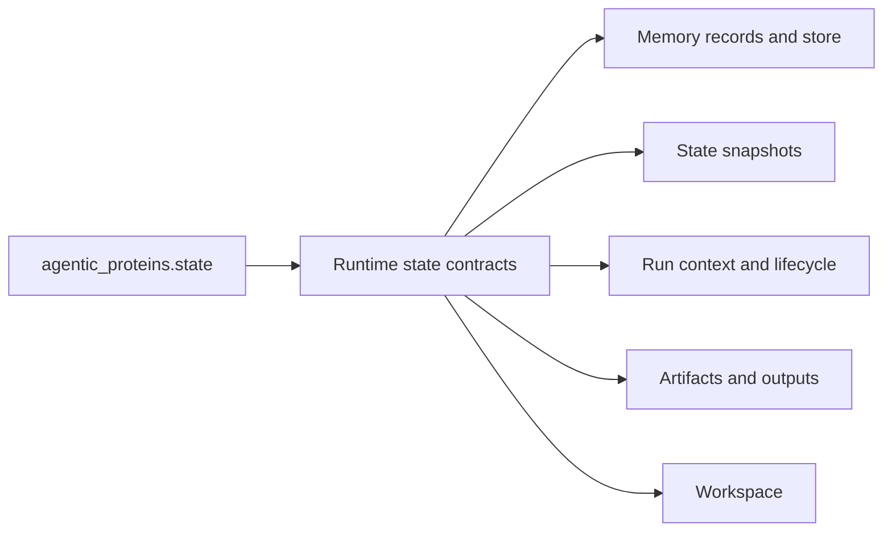

# State and Persistence

`agentic-proteins` owns no durable state. Its `state` namespace forwards memory records, scopes, stores, snapshots, run context, lifecycle, requests, outputs, and workspace helpers to `bijux-proteomics-runtime`.

## Forwarded state surfaces

- `MemoryRecord`, `MemoryScope`, and `MemoryStore` come from runtime state modules.
- `StateSnapshot` and `snapshot_state` use the runtime snapshot contract.
- Run context, request, lifecycle, and output modules forward runtime run owners.
- Workspace helpers forward the runtime support implementation.

Historical imports can therefore rehydrate the same state as canonical imports. They do not create a compatibility database, alternate workspace root, parallel run ledger, or second artifact naming scheme.

## Persistence invariants

Run identity, snapshot schema, artifact paths, hashes, event ordering, and resume behavior must be independent of which import path initiated execution. A historical caller may appear in provenance as the entry surface, but the durable record remains runtime-owned and runtime-readable.

Removing a historical state path is safe only after consumers have a documented canonical replacement and compatibility tests no longer promise it. Existing durable records must remain readable through runtime; they must not require the compatibility package as their only decoder.
