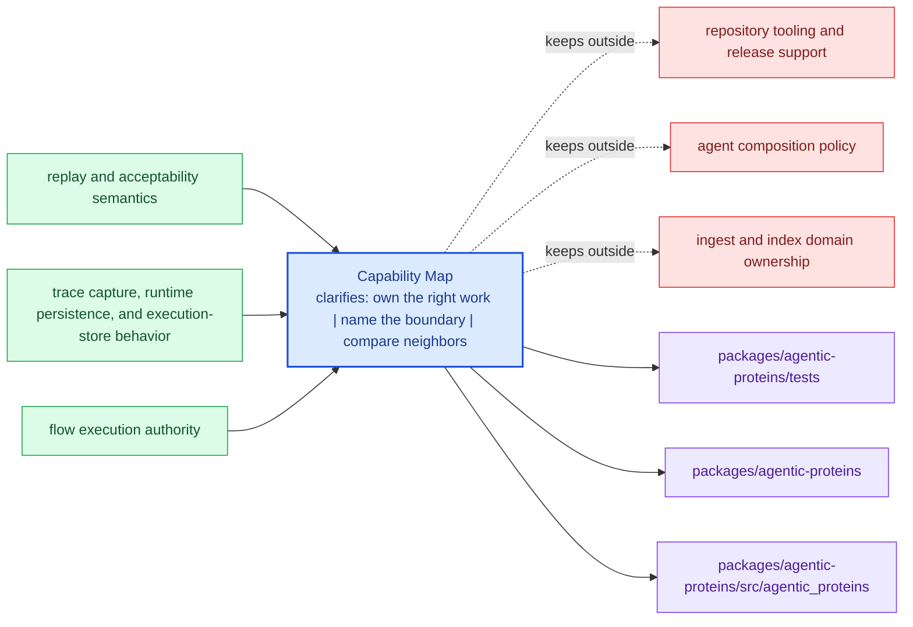

# Capability Map

The fastest way to understand `agentic-proteins` is to map capabilities to the
code that carries them. This page should help a reader move from a package claim
to a likely code area without pretending that module names alone are enough.

When this page is healthy, the package feels like a set of deliberate abilities,
not a pile of implementation details.

Treat the foundation pages for `agentic-proteins` as the package's durable self-description. If the package still feels blurry after this section, the boundary story is not clear enough yet.

## Visual Summary

## Capability Map

- `src/agentic_proteins/model` for durable runtime models
- `src/agentic_proteins/runtime` for execution engines and lifecycle logic
- `src/agentic_proteins/application` for orchestration and replay coordination
- `src/agentic_proteins/verification` for runtime-level validation support
- `src/agentic_proteins/interfaces` for CLI surfaces and manifest loading
- `src/agentic_proteins/api` for HTTP application surfaces

## Produced Artifacts

- execution store records
- replay decision artifacts
- non-determinism policy evaluations

## Concrete Anchors

- `packages/agentic-proteins` as the package root
- `packages/agentic-proteins/src/agentic_proteins` as the import boundary
- `packages/agentic-proteins/tests` as the package proof surface

## Use This Page When

- you need the package idea before the implementation detail
- you are deciding whether work belongs here or in a neighboring package
- you want the shortest honest explanation of what this package is for

## Decision Rule

Use `Capability Map` to decide whether a change makes `agentic-proteins` easier or harder to defend as one distinct role in the overall system. If the work makes the package broader without making its role clearer, stop and re-check the boundary before treating the change as a local improvement.

## What This Page Answers

- what problem `agentic-proteins` is supposed to own on purpose
- where the package boundary stops, even when nearby code looks tempting
- which neighboring package seams deserve comparison before the boundary is changed

## Reviewer Lens

- compare the stated boundary with the modules, artifacts, and tests that are supposed to uphold it
- check that out-of-scope behavior is not quietly re-entering through convenience paths
- confirm that the package story still matches the real repository layout and neighboring package docs

## Honesty Boundary

This page can explain the intended boundary of `agentic-proteins`, but it cannot prove that boundary by itself. The real proof still lives in the code, tests, and neighboring package seams that either support or contradict the story told here.

## Next Checks

- move to architecture when the question becomes structural rather than boundary-oriented
- move to interfaces when the question becomes contract-facing
- move to quality when the question becomes proof or review sufficiency

## Purpose

This page helps a reader quickly map package claims to code areas.

## Stability

Keep it aligned with the real package modules and generated outputs.
