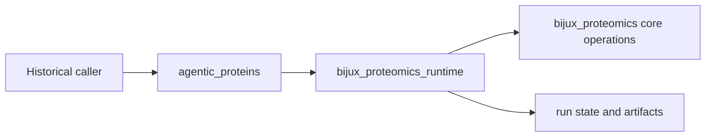

# Capability Map

`agentic-proteins` preserves historical access to runtime capabilities while applications move to `bijux-proteomics-runtime`. It is a compatibility distribution, not an independent execution platform.

## Supported compatibility surfaces

| Surface | Historical entry | Canonical owner |
| --- | --- | --- |
| Python root | `agentic_proteins.AppConfig`, `RunManager`, `create_app`, `cli` | `bijux_proteomics_runtime` |
| Command line | `agentic-proteins` | Runtime CLI implementation |
| HTTP application | `agentic_proteins.interfaces.http` | Runtime HTTP interfaces |
| Agents and tools | `agentic_proteins.agents`, `agentic_proteins.tools` | Runtime execution families |
| Providers | local, remote, and experimental provider paths | Runtime provider selection and implementations |
| State | historical state models and helpers | Runtime run, artifact, and persistence owners |
| Execution | compiler, evaluation, and runtime paths | Runtime execution and orchestration owners |

Optional extras such as `api`, `nl`, `local-esmfold`, and `local-rosettafold` forward the corresponding runtime capability. Installing an extra changes available providers or interfaces; it does not transfer their ownership into this package.

## Deliberate limits

New scheduling, provider, state, API, workflow, or artifact behavior belongs in runtime first. New scientific calculations belong in core. The compatibility package may add forwarding required to preserve an established historical path, but it must not acquire a competing implementation or a stronger behavior contract than the canonical owner.

Consumers can therefore use the bridge for controlled migration while treating the runtime handbook as the authoritative capability description.
