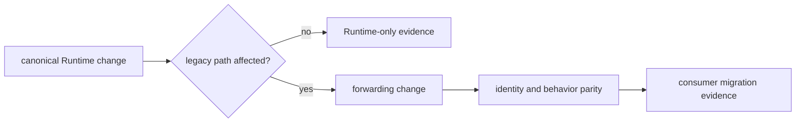

# Change Principles

Every `agentic-proteins` change must reduce migration uncertainty without
creating independent product behavior. The package may preserve a supported
historical path; it may not become an alternate place to design Runtime.

## Change Classes

| Change | Required treatment |
| --- | --- |
| new Runtime capability | implement and document in `bijux-proteomics-runtime`; do not add bridge ownership |
| canonical symbol move | update forwarding map and verify object identity |
| legacy CLI or HTTP compatibility | preserve arguments, routes, errors, and observable behavior through canonical implementation |
| supported nested import change | update the migration ledger and downstream import tests |
| deprecation | publish replacement, warning behavior, supported window, and removal evidence |
| retirement | prove consumer migration and remove forwarding, docs, tests, and packaging contract together |

## Invariants

- The root exports remain `AppConfig`, `RunManager`, `cli`, and `create_app`
  until an explicit compatibility decision changes them.
- Forwarded objects preserve canonical identity wherever the contract promises
  aliases rather than adapters.
- Defaults, exceptions, state transitions, serialization, CLI status, and HTTP
  behavior do not drift behind the old package name.
- New product logic and policy land with the canonical owner first.
- A compatibility warning must not alter successful behavior or hide failure.
- Removal is based on consumer evidence, not repository-local import counts.

## Review Evidence

For import changes, compare object identity and supported path inventory. For
CLI changes, compare help, options, exit status, stdout/stderr, and artifacts.
For HTTP changes, compare application construction, routes, middleware,
dependencies, and structured errors. Run
`make quality-runtime-migration-validation` plus the affected package and
consumer tests.

Avoid mixing a path migration with semantic change. When both are required for
correctness, make the canonical behavior explicit and retain a parity test that
shows exactly what the compatibility consumer observes.
