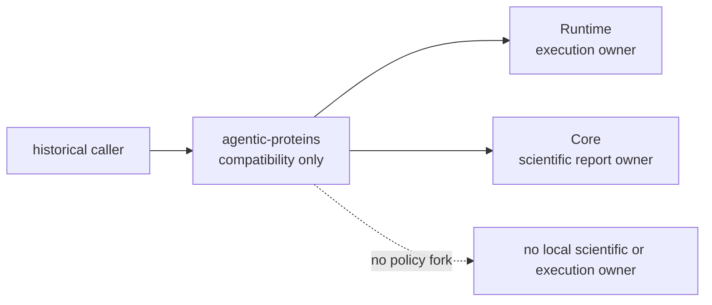

# Dependencies and adjacencies

`agentic-proteins` depends on `bijux-proteomics-runtime` and
`bijux-proteomics-core` because it preserves historical surfaces now owned by
those packages. These dependencies are forwarding destinations, not permission
to define execution or scientific behavior locally.

## Direct dependency contract

| Dependency | Why it is installed | What remains outside the bridge |
| --- | --- | --- |
| `bijux-proteomics-runtime` | canonical targets for execution, providers, state, CLI, and HTTP forwarding | new runtime behavior, provider policy, run state, and persistence semantics |
| `bijux-proteomics-core` | canonical targets for historical scientific report imports | scientific models, calculations, validation rules, and result interpretation |

The dependency range keeps the bridge on the same coordinated release line as
its owners. A successful installation proves only that compatible distributions
were resolved; caller parity still requires observable import, command, HTTP,
configuration, persistence, and execution checks.

## Optional capabilities

The `api`, `local-esmfold`, `local-rosettafold`, and `nl` extras delegate to the
matching Runtime extras. The bridge does not assemble its own provider stack.
Installing an extra through the historical distribution and installing it
through Runtime must reach the same canonical capability and the same
environment constraints.

| Historical request | Canonical authority | Boundary condition |
| --- | --- | --- |
| HTTP application | `bijux-proteomics-runtime[api]` | route and error behavior remain Runtime-owned |
| local ESMFold | `bijux-proteomics-runtime[local-esmfold]` | model, hardware, and dependency checks remain visible |
| local RoseTTAFold | `bijux-proteomics-runtime[local-rosettafold]` | provider availability cannot be implied by bridge installation |
| natural-language support | `bijux-proteomics-runtime[nl]` | provider configuration and network behavior remain explicit |

## Adjacency decisions

The bridge may translate a historical name into a canonical public name. It
may not translate scientific meaning, choose a provider, change a default, or
invent a replacement for a dead module.

| Proposed change | Correct destination |
| --- | --- |
| new execution command, run state, checkpoint, or provider | Runtime |
| new scientific result, parser, calculation, or acceptance rule | Core |
| new compatibility wrapper for an actively supported caller | bridge, with a named canonical target and parity evidence |
| historical module with no supported target | migration ledger as dead; caller removes the dependency |
| alias-specific exception or default | reject unless it preserves a documented canonical contract |

## Review the dependency edge

For any dependency change, verify four facts:

1. the bridge still has exactly one canonical owner for each forwarded surface;
2. optional extras delegate to Runtime rather than constructing parallel stacks;
3. dependency floors cover the lowest supported canonical release combination;
4. removal or narrowing includes caller evidence, not only a green bridge test.

Use the [compatibility contract](compatibility-contract.md) for guarantees, the
[canonical migration guide](../../09-bijux-proteomics-runtime/migration-ledger/agentic-proteins-canonical-migration-guide.md)
for module destinations, and [change validation](../quality/change-validation.md)
for the proof required before release.
