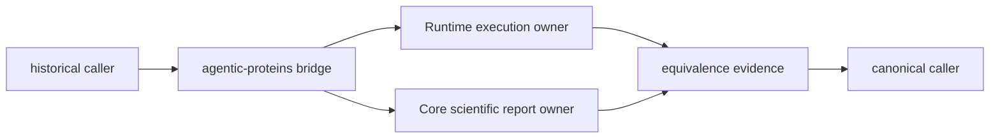
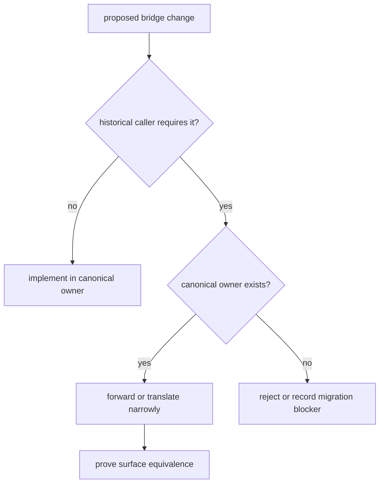

# Compatibility foundations

`agentic-proteins` preserves named interfaces required by historical callers
while `bijux-proteomics-runtime` owns execution behavior. The boundary is
deliberately asymmetric: the bridge may forward to canonical packages, but
canonical packages never depend on the bridge.

## Contract routes

| Question | Guide | Decision |
| --- | --- | --- |
| Why does the distribution exist? | [Package overview](package-overview.md) | bridge required by a supported historical caller |
| Is a surface in scope? | [Scope and non-goals](scope-and-non-goals.md) | preserve, migrate, or reject |
| Where must behavior change? | [Ownership boundary](ownership-boundary.md) | bridge or canonical owner |
| Which behaviors may the bridge perform? | [Capability map](capability-map.md) | forward, translate, warn, or report |
| Which packages may it depend on? | [Dependencies and adjacencies](dependencies-and-adjacencies.md) | allowed one-way dependency |
| What permits a surface to disappear? | [Lifecycle overview](lifecycle-overview.md) | caller evidence and removal gate |

The [compatibility contract](compatibility-contract.md) is authoritative when a
convenient local change conflicts with the bridge boundary.

## Owned surfaces

The package owns compatibility behavior for historical:

- `agentic_proteins` Python imports;
- `agentic-proteins` command invocation;
- HTTP module paths and route assembly;
- configuration and state translation required for canonical execution;
- migration diagnostics and explicit failure when equivalence is unavailable.

It does not own providers, run state machines, replay semantics, scientific
reports, benchmarks, evidence interpretation, or new feature design. Those
changes begin in the canonical package and flow through the bridge only when a
declared compatibility contract requires forwarding.

## Compatibility decisions

A bridge change is justified by a concrete caller contract, not by the
possibility that somebody might use it. Compatibility code remains narrow,
observable, and removable once its declared consumers have migrated.

## Proof obligations

| Surface | Minimum proof |
| --- | --- |
| Python import | legacy import resolves to the declared canonical object or an explicit removal error |
| CLI | command, arguments, exit status, standard output, standard error, and artifacts are compared |
| HTTP | route, request, response, status, and error contracts are compared |
| configuration | accepted keys, defaults, rejection behavior, and translation are compared |
| persisted state | schema identity, checkpoint loading, and replay behavior are compared |

Package tests protect local forwarding. Repository migration validation checks
the complete ledger and cross-package equivalence. Both are required because a
bridge can import successfully while still changing operational behavior.

## Language and change rules

The [domain language](domain-language.md) distinguishes bridge, canonical owner,
forwarder, translation, equivalence, and removal. The
[change principles](change-principles.md) apply those terms to implementation
and release decisions. [Repository fit](repository-fit.md) explains how the
distribution participates in the wider package family without becoming a
second runtime.

For canonical execution behavior, continue to the
[Runtime handbook](../../09-bijux-proteomics-runtime/index.md). For repository
migration gates, continue to
[runtime migration validation](../../01-bijux-proteomics/operations/runtime-migration-validation.md).
