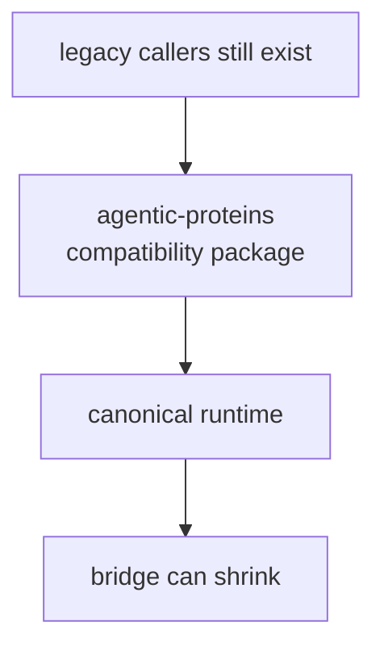

# Foundation

The foundation section explains the durable role of `agentic-proteins` before it
explains implementation detail. Use it to resolve why preserved legacy surfaces still belong here instead of in the canonical runtime package.

## Why This Section Exists

- it helps the reader understand why a package can be valuable even while being
  temporary
- it makes retirement pressure explicit instead of letting compatibility linger
  without a reason
- it distinguishes bridge ownership from canonical runtime ownership

## Start With

- Open [Package Overview](https://bijux.io/bijux-proteomics/02-agentic-proteins/foundation/package-overview/) for the shortest statement of
  the package role.
- Open [Ownership Boundary](https://bijux.io/bijux-proteomics/02-agentic-proteins/foundation/ownership-boundary/) when the question is
  whether a change belongs here or in a neighbor.
- Open [Scope and Non-Goals](https://bijux.io/bijux-proteomics/02-agentic-proteins/foundation/scope-and-non-goals/) when a proposed change
  risks broadening the package.
- Open [Capability Map](https://bijux.io/bijux-proteomics/02-agentic-proteins/foundation/capability-map/) when you need the concrete work
  the package is allowed to do.

## Section Pages

- [Package Overview](https://bijux.io/bijux-proteomics/02-agentic-proteins/foundation/package-overview/)
- [Scope and Non-Goals](https://bijux.io/bijux-proteomics/02-agentic-proteins/foundation/scope-and-non-goals/)
- [Ownership Boundary](https://bijux.io/bijux-proteomics/02-agentic-proteins/foundation/ownership-boundary/)
- [Capability Map](https://bijux.io/bijux-proteomics/02-agentic-proteins/foundation/capability-map/)
- [Dependencies and Adjacencies](https://bijux.io/bijux-proteomics/02-agentic-proteins/foundation/dependencies-and-adjacencies/)
- [Repository Fit](https://bijux.io/bijux-proteomics/02-agentic-proteins/foundation/repository-fit/)
- [Lifecycle Overview](https://bijux.io/bijux-proteomics/02-agentic-proteins/foundation/lifecycle-overview/)
- [Domain Language](https://bijux.io/bijux-proteomics/02-agentic-proteins/foundation/domain-language/)
- [Change Principles](https://bijux.io/bijux-proteomics/02-agentic-proteins/foundation/change-principles/)

## What This Section Settles

- whether a preserved surface still needs a bridge
- whether compatibility logic is still narrow enough to stay here
- when a legacy concern should move fully into runtime or disappear

## First Proof Check

- `packages/agentic-proteins`
- `packages/agentic-proteins/tests`
- neighboring handbooks once the change crosses the local boundary

## Neighbors

- Open [bijux-proteomics-runtime](https://bijux.io/bijux-proteomics/09-bijux-proteomics-runtime/)
  when the question leaves compatibility forwarding for legacy runtime imports and entrypoints.
- Open [Repository Handbook](https://bijux.io/bijux-proteomics/01-bijux-proteomics/)
  when the issue is clearly outside this package's local role.
