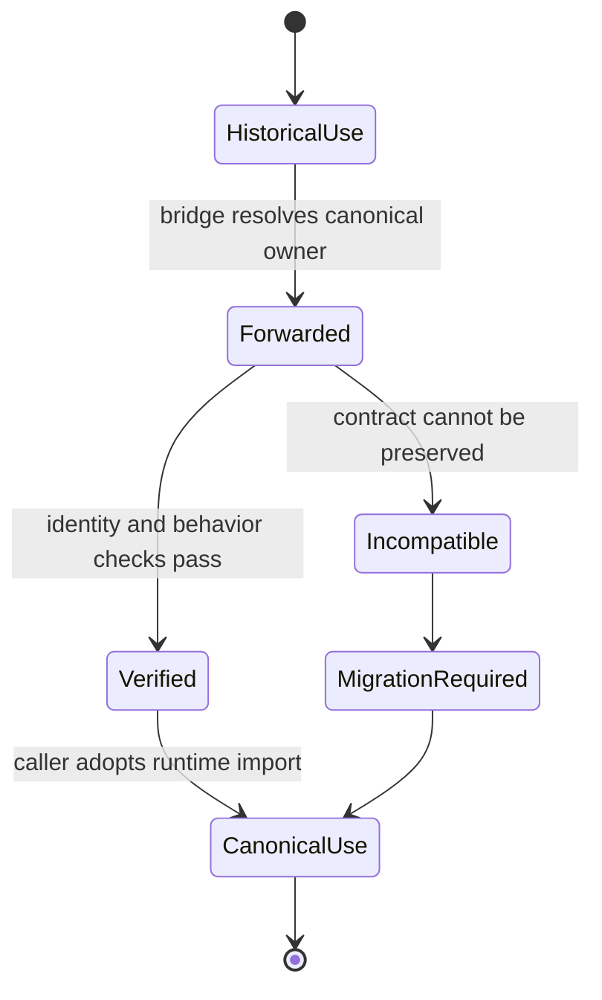
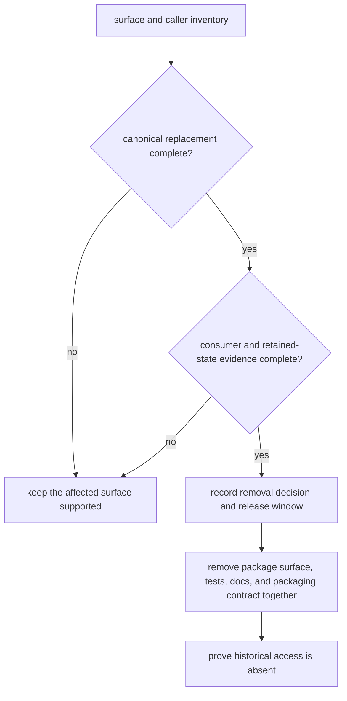

# Lifecycle Overview

The compatibility lifecycle begins when a caller still relies on an `agentic_proteins` import, command, or optional extra. The bridge resolves that historical surface to the canonical runtime object and preserves observable behavior while the caller migrates.

## Resolution path

At the package root, public objects are loaded lazily from `bijux_proteomics_runtime`. Compatibility modules follow the same principle: route to the canonical implementation rather than wrap it with new semantics. Object identity matters for public classes and callables because exception handling, type checks, plugin registration, and introspection can all break when a bridge creates look-alike objects.

The command and HTTP paths must converge on the same runtime behavior as canonical entrypoints. Optional dependencies remain explicit: a historical extra should enable the matching runtime extra or fail with actionable dependency information.

## Change lifecycle

A runtime contract change is reviewed against both canonical and compatibility surfaces. If forwarding remains exact, the bridge changes only where the historical path requires it. If exact compatibility is impossible, the migration must be documented as a consumer-visible break; the bridge must not silently reinterpret arguments, results, state, or artifacts.

The desired endpoint is direct use of `bijux_proteomics_runtime`. Historical access can remain available for supported releases, but new applications should not build fresh dependencies on the compatibility namespace.

## Evidence at each transition

| Transition | Required record | Stop condition |
| --- | --- | --- |
| historical use to forwarded | surface inventory and canonical destination | no canonical owner or undocumented translation |
| forwarded to verified | identity or adapter contract, positive path, negative path, and retained artifact comparison | different defaults, outcomes, state, errors, or artifacts |
| verified to canonical use | consumer change, consumer integration result, and canonical run evidence | caller still depends on historical import, executable, extra, or transport behavior |
| canonical use to retirement-ready | remaining-caller inventory, supported release decision, and removal impact | unknown callers or retained data still require bridge code |
| retirement-ready to removed | synchronized package, documentation, test, build, and release changes | any historical surface remains accidentally importable or advertised |

Verification is surface-specific. Root object identity does not prove nested
HTTP behavior; help parity does not prove state or artifact parity; a clean
repository search does not prove external caller migration.

## Retirement closure

Closure means the caller no longer needs the bridge and the canonical record
can be interpreted without it. A warning, deprecation date, or successful
canonical smoke test is not closure evidence by itself.
