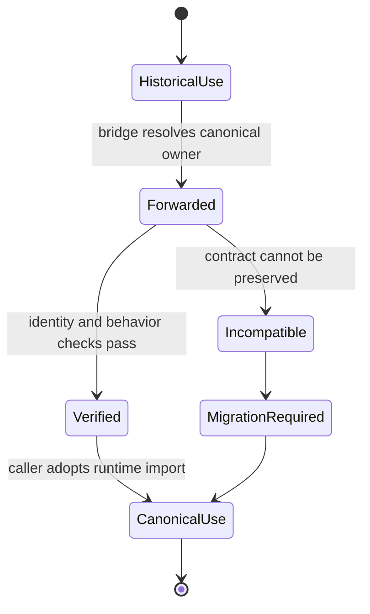

# Lifecycle Overview

The compatibility lifecycle begins when a caller still relies on an `agentic_proteins` import, command, or optional extra. The bridge resolves that historical surface to the canonical runtime object and preserves observable behavior while the caller migrates.

## Resolution path

At the package root, public objects are loaded lazily from `bijux_proteomics_runtime`. Compatibility modules follow the same principle: route to the canonical implementation rather than wrap it with new semantics. Object identity matters for public classes and callables because exception handling, type checks, plugin registration, and introspection can all break when a bridge creates look-alike objects.

The command and HTTP paths must converge on the same runtime behavior as canonical entrypoints. Optional dependencies remain explicit: a historical extra should enable the matching runtime extra or fail with actionable dependency information.

## Change lifecycle

A runtime contract change is reviewed against both canonical and compatibility surfaces. If forwarding remains exact, the bridge changes only where the historical path requires it. If exact compatibility is impossible, the migration must be documented as a consumer-visible break; the bridge must not silently reinterpret arguments, results, state, or artifacts.

The desired endpoint is direct use of `bijux_proteomics_runtime`. Historical access can remain available for supported releases, but new applications should not build fresh dependencies on the compatibility namespace.
