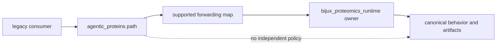

# Ownership Boundary

Agentic Proteins owns compatibility mapping and migration continuity. Runtime
owns every canonical execution meaning reached through that mapping.

## Owned Here

- the four-name root forwarding contract;
- supported historical nested import mappings;
- the `agentic-proteins` console entrypoint;
- historical HTTP application construction paths;
- compatibility inventories, parity tests, migration guidance, deprecation,
  and retirement evidence.

## Owned Elsewhere

| Concern | Owner |
| --- | --- |
| execution models, orchestration, state, providers, tools, artifacts | Runtime |
| scientific algorithms and benchmark meaning | Core |
| evidence custody and grounding | Knowledge |
| recommendation and refusal policy | Intelligence |
| laboratory consequence and outcomes | Lab |
| repository migration validation | Maintainer tooling |

Files under historical `execution/`, `orchestration/`, `providers/`, `state/`,
and `tools/` paths exist to preserve supported access. Their public meaning is
defined by the canonical Runtime target, not by their location in this package.

## Placement Decision

Keep a change here only when it updates forwarding, parity, migration, or
retirement. Move it to Runtime when it changes behavior, schema, state,
provider selection, artifact emission, or failure semantics. Move it to the
relevant product package when the concern is scientific, evidential,
decision-making, or laboratory-facing.

A bridge that needs its own policy, persistence, or product tests has crossed
the ownership boundary. Redesign the canonical Runtime surface and forward to
it instead.
