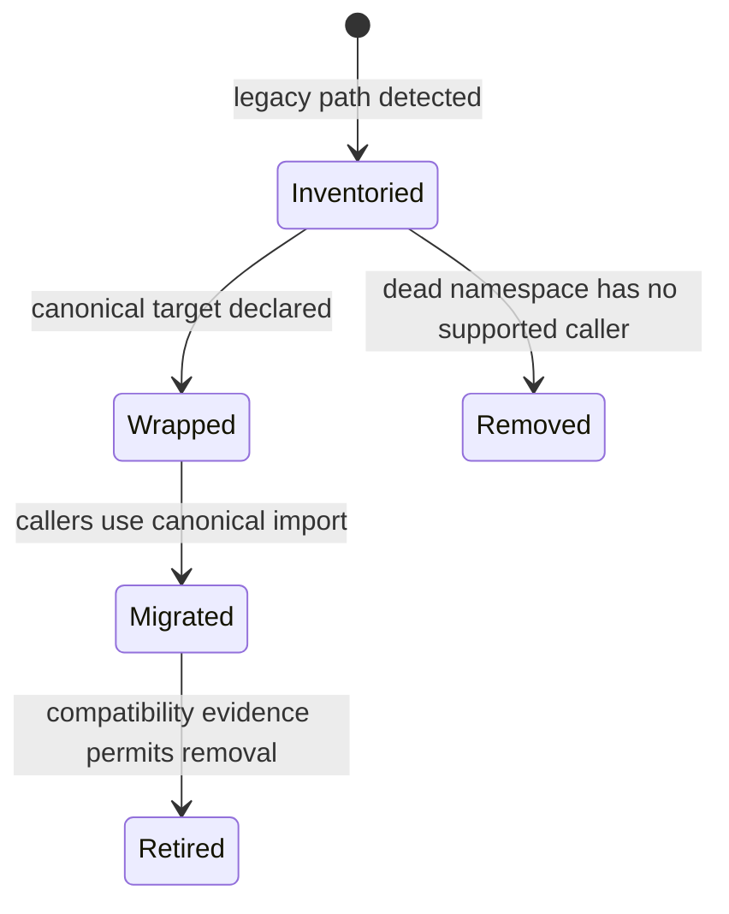

# Package overview

`agentic-proteins` is a migration bridge, not a second runtime. Its source tree
mirrors historical module families so existing imports keep resolving while
their objects are supplied by canonical modules.

## Preserved surfaces

| Surface | Compatibility behavior | Canonical owner |
| --- | --- | --- |
| Python execution and orchestration imports | re-export run, execution, agent, tool, and state objects | `bijux-proteomics-runtime` |
| provider imports | re-export provider contracts and local, remote, or heuristic implementations | `bijux-proteomics-runtime` |
| CLI | expose the canonical Click command group under `agentic-proteins` | `bijux-proteomics-runtime` |
| HTTP application and v1 routes | forward application, route, schema, and error imports | `bijux-proteomics-runtime` |
| structure reports | forward report behavior to the scientific owner | `bijux-proteomics-core` |

The bridge may depend only on core and runtime. It must not acquire direct
dependencies on foundation, knowledge, intelligence, lab, development tooling,
or alias distributions.

## Migration lifecycle

The generated compatibility inventory classifies every module. A `wrapper`
must remain behavior-free beyond adaptation needed to preserve its contract. A
`dead` module has no canonical behavior and should not gain any. A `canonical`
or `duplicate` classification inside this package is a boundary violation.

## Safe use

1. Pin the compatibility package and canonical runtime to compatible releases.
2. Identify imported `agentic_proteins` modules and invoked legacy commands.
3. Map each import through the
   [migration guide](../../09-bijux-proteomics-runtime/migration-ledger/agentic-proteins-canonical-migration-guide.md).
4. Move application tests to canonical imports.
5. Remove the compatibility dependency after all preserved surfaces disappear
   from the application.

Do not add new application code against this package. The
[canonical runtime handbook](../../09-bijux-proteomics-runtime/index.md)
documents the maintained execution surface.
