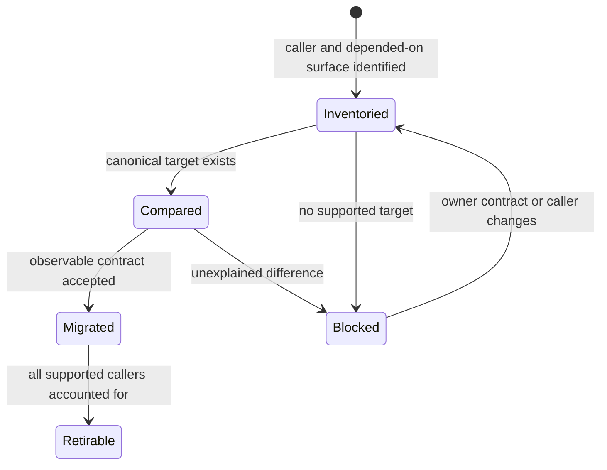

# Repository fit

`agentic-proteins` exists as a separately published compatibility boundary for
callers that still use historical imports, commands, or HTTP module paths. Its
value is consumer continuity during migration. It is not a second execution
product and is not the home for new capabilities.

## Why a separate distribution exists

Removing the historical distribution would turn an import or command migration
into an unannounced installation failure. Folding its wrappers into Runtime
would place old names inside the canonical namespace and make eventual removal
harder to audit. The separate distribution keeps three facts visible:

- which consumer chose the historical installation surface;
- which canonical package owns the forwarded behavior;
- which compatibility routes remain before the bridge can be retired.

`Retirable` is a repository decision. One migrated application cannot establish
that notebooks, services, automation, or external consumers no longer use the
distribution.

## What belongs here

| Belongs in `agentic-proteins` | Belongs with the canonical owner |
| --- | --- |
| direct forwarding from a supported historical name | scientific and execution implementation |
| compatibility errors that name the migration destination | provider, retry, checkpoint, and run-state policy |
| caller parity tests and migration records | canonical API, CLI, and HTTP contracts |
| deprecation and retirement evidence | new public capability and documentation |

A wrapper is justified only when a supported consumer needs it and its behavior
can be stated as a canonical contract plus a compatibility mapping. Code that
requires bridge-local domain types, orchestration, persistence, or policy no
longer fits this package.

## Repository relationships

| Neighbor | Relationship |
| --- | --- |
| Runtime | canonical owner for execution, providers, state, CLI, and HTTP behavior |
| Core | canonical owner for historical scientific report surfaces still forwarded by the bridge |
| Foundation | indirect contract owner through canonical packages; the bridge does not create shared schemas |
| Maintainer tooling | owns migration inventories, boundary checks, and release validation |

The bridge has no authority over Knowledge evidence, Intelligence decisions, or
Lab readiness. Historical names that appear to cross those domains must resolve
to their actual canonical owner or be removed from the caller.

## Fit tests

The package remains coherent only while all of these statements are true:

1. every public bridge route names one canonical target or an explicit dead
   disposition;
2. new behavior lands in a canonical package before any compatibility wrapper;
3. observable differences are documented migration contracts, never accidental
   drift;
4. package-local state does not become a competing source of truth;
5. retirement decisions are based on consumer evidence and release records.

Start with [Do you need this package?](../index.md#do-you-need-this-package),
then use the [migration pattern](../index.md#migration-pattern) and
[caller migration record](../index.md#caller-migration-record) to move each
consumer to its canonical owner.
