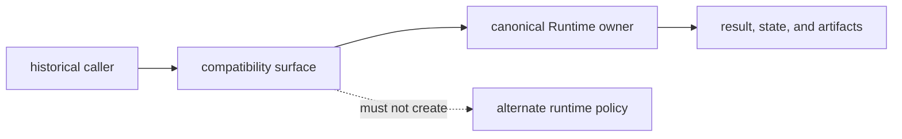

# Scope and Non-Goals

`agentic-proteins` preserves named historical access to behavior now owned by
`bijux-proteomics-runtime`. Its scope is defined by observable caller
contracts: imports, the console command, HTTP application construction,
optional extras, exceptions, and retained runtime artifacts. It is not a
second runtime implementation.

## In Scope

| Supported concern | Compatibility obligation | Canonical authority |
| --- | --- | --- |
| root exports | historical and canonical imports resolve to the promised object identity | Runtime public API |
| nested imports listed in the migration ledger | path remains importable or fails through an explicit compatibility decision | owning Runtime module |
| `agentic-proteins` executable | command tree, options, defaults, exit behavior, output envelopes, and artifacts match Runtime | Runtime CLI |
| HTTP application factory | routes, middleware, dependencies, errors, and lifecycle behavior remain equivalent | Runtime HTTP surface |
| optional extras | a historical extra selects the matching Runtime capability or reports its absence clearly | Runtime provider boundary |
| warnings and migration guidance | callers receive a canonical replacement without altered successful behavior | compatibility package |

## Out Of Scope

- new providers, orchestration rules, retry policy, state machines, persistence,
  output formats, or HTTP behavior;
- scientific models or acceptance policy owned by Core;
- evidence, recommendation, or laboratory policy;
- a legacy-only interpretation of Runtime state or artifacts; and
- removal based only on repository search, elapsed time, or package-local green
  tests.

## Decide where a change belongs

| Proposed change | Decision |
| --- | --- |
| add or change runtime behavior | implement and prove it in Runtime first |
| restore a documented historical path | add the narrowest forwarding route and parity evidence here |
| translate an old argument or result | require an explicit adapter contract; never present translation as object identity |
| preserve old durable state | decode through a Runtime-owned schema; do not make the bridge a state owner |
| remove a path | require canonical replacement, caller evidence, release communication, and negative import proof |

The boundary is satisfied only when a reviewer can name the historical
surface, canonical destination, parity dimensions, remaining callers, and
removal condition. Unknown callers keep a supported surface open; they do not
justify adding new bridge-owned behavior.
