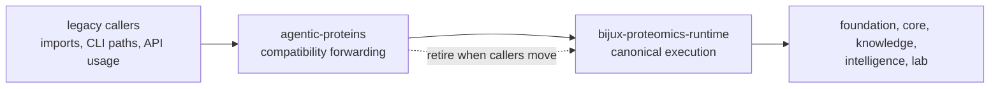

# agentic-proteins

`agentic-proteins` is the strict compatibility package in
`bijux-proteomics`. It preserves legacy runtime imports and entrypoints long
enough for callers to migrate to `bijux-proteomics-runtime`. Its value is not
new capability. Its value is controlled continuity while the old surface is
retired without breaking downstream users in the dark.

It is now tracked as an explicit compatibility bridge beneath the six real
product packages. That means its release case depends on a checked migration
path and a wrapper-only inventory, not on growing new product value inside the
bridge itself.

## Why This Package Still Matters

- it absorbs migration pain so the canonical runtime can keep moving
- it keeps legacy entrypoints visible instead of burying them in silent shims
- it provides a defensible retirement surface: each preserved path should have
  a reason to exist, not only inertia

## What It Owns

- compatibility forwarding for legacy runtime imports
- preserved legacy CLI and API entrypoints while migration is still justified
- the proof bar for keeping or retiring those preserved surfaces
- the checked migration guide and compatibility inventory that explain how old
  imports collapse back to canonical package ownership

## Shared Reader Routes

- Use [Product Overview](https://bijux.io/bijux-proteomics/01-bijux-proteomics/foundation/product-overview/)
  when the question is still product-wide rather than compatibility-specific.
- Use [Execution](https://bijux.io/bijux-proteomics/09-bijux-proteomics-runtime/execution-overview/)
  when the question is about canonical runtime behavior instead of the legacy
  bridge.

## Start Inside This Package

- Open [Foundation](https://bijux.io/bijux-proteomics/02-agentic-proteins/foundation/)
  when you need the package boundary first.
- Open [Interfaces](https://bijux.io/bijux-proteomics/02-agentic-proteins/interfaces/)
  when the question is a preserved import, CLI, API, or compatibility contract.
- Open [Operations](https://bijux.io/bijux-proteomics/02-agentic-proteins/operations/)
  when the question is local migration or release behavior inside the bridge.

## What Should Make A Reader Suspicious

- a feature that is attractive even without any legacy caller
- business logic growing inside the bridge instead of inside runtime
- compatibility wording that no longer points to a real migration path

## First Proof Check

- `packages/agentic-proteins`
- `packages/agentic-proteins/src/agentic_proteins`
- `packages/agentic-proteins/tests`
- `docs/09-bijux-proteomics-runtime/migration-ledger/agentic-proteins-canonical-migration-guide.md`
- `docs/09-bijux-proteomics-runtime/migration-ledger/agentic-proteins-compatibility-inventory.md`

## Boundary

If the behavior would still be desirable after legacy callers disappear, it
probably belongs in the canonical runtime package instead of here.
