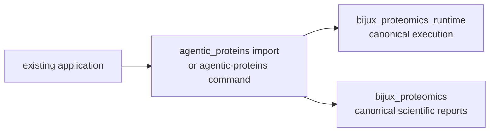
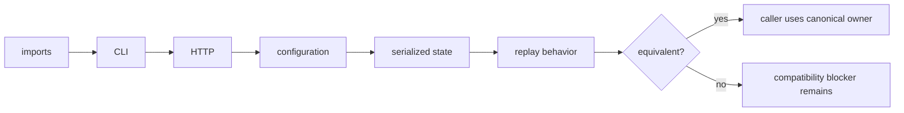
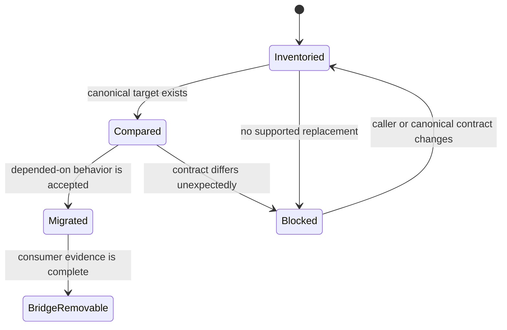
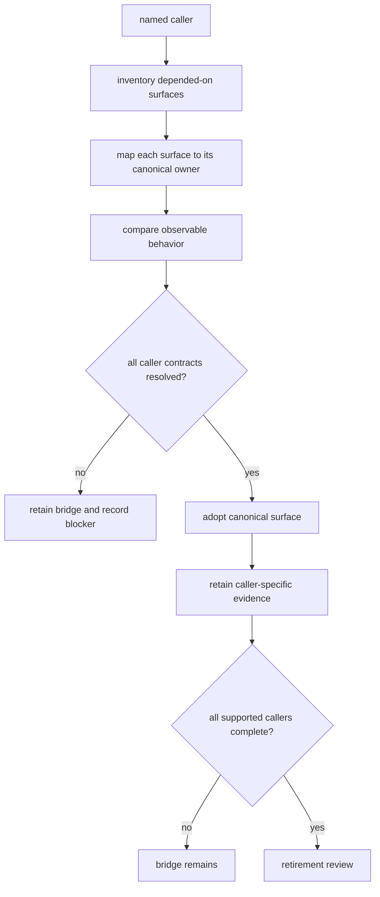

# agentic-proteins

`agentic-proteins` is the compatibility distribution for applications built on
the original execution package. It preserves historical imports, the
`agentic-proteins` command, and legacy HTTP module paths while canonical
implementation lives in `bijux-proteomics-runtime` and, for scientific report
surfaces, `bijux-proteomics-core`.

`agentic-proteins` is the strict compatibility package: it does not compete
with Runtime for ownership of new execution behavior.

## Three compatibility decisions

Compatibility forwarding, caller migration, and package retirement answer
different questions. Evidence for one must not be promoted into evidence for
another.

| Decision | Required evidence | Valid conclusion | Invalid promotion |
| --- | --- | --- | --- |
| does this bridge surface forward correctly? | symbol identity or behavioral parity for the declared import, command, route, state, and artifact contract | the checked bridge surface matches its canonical owner under the tested contract | every caller is compatible |
| has this caller migrated? | named consumer, legacy and canonical versions, exercised surfaces, accepted differences, and consumer-owned tests | this consumer accepts the canonical contract | the package is removable |
| is the package removable? | complete supported-consumer inventory, caller dispositions, repository dependency closure, publication policy, and release approval | no supported consumer still requires the bridge | undeclared external consumers do not exist |

A forwarding defect belongs to the bridge or canonical owner. A caller-specific
adaptation belongs in that consumer's migration record. An incomplete inventory
blocks retirement even when every repository test passes.

Install it only when an existing caller still depends on those names:

```bash
python -m pip install agentic-proteins
agentic-proteins --help
```

New applications should install `bijux-proteomics-runtime` and use the
`bijux-proteomics-runtime` command.

## Do you need this package?

| Caller condition | Install | Migration action | Closure evidence |
| --- | --- | --- | --- |
| code imports `agentic_proteins` | `agentic-proteins` and the canonical owner during migration | replace each import using the generated migration guide | caller tests exercise the canonical public symbol and no depended-on legacy import remains |
| automation invokes `agentic-proteins` | `agentic-proteins` | compare command output and exit behavior with `bijux-proteomics-runtime` | canonical invocation satisfies arguments, exit status, streams, and artifact expectations |
| a service imports a historical HTTP module | `agentic-proteins` | move routes and request models to `bijux_proteomics_runtime.api` | consumer contract tests pass for routes, schemas, statuses, and error envelopes |
| new code needs execution, providers, replay, or run evidence | `bijux-proteomics-runtime` | use the canonical API directly | dependency inventory contains no compatibility path |
| new code needs scientific report models | `bijux-proteomics-core` | use the Core owner directly | report imports and serialization contracts resolve to Core |

Compatibility is a caller property, not a second product mode. A deployment
may need the bridge while one historical dependency remains; new components in
that deployment can still use canonical packages directly.

## Compatibility flow



The command surfaces are intentionally equivalent. Both currently expose
`run`, `resume`, `compare`, `reproduce`, `inspect-candidate`, `import-result`,
`export-report`, `identity`, and `api`. Forwarding must preserve exit behavior
and output contracts while a caller migrates.

## Migration pattern

Replace legacy modules with their canonical owners:

```python
# Historical
from agentic_proteins.execution.manager import RunManager

# Canonical
from bijux_proteomics_runtime.runs.manager import RunManager
```

Common mappings include:

| Historical family | Canonical family |
| --- | --- |
| `agentic_proteins.execution.*` | `bijux_proteomics_runtime.runs.*` or `bijux_proteomics_runtime.execution.*` |
| `agentic_proteins.orchestration.*` | `bijux_proteomics_runtime.execution.*` and `bijux_proteomics_runtime.runs.*` |
| `agentic_proteins.providers.*` | `bijux_proteomics_runtime.providers.*` |
| `agentic_proteins.state.*` | `bijux_proteomics_runtime.state.*` and `bijux_proteomics_runtime.runs.*` |
| `agentic_proteins.tools.*` | `bijux_proteomics_runtime.execution.tools.*` |
| `agentic_proteins.interfaces.http.*` | `bijux_proteomics_runtime.api.*` |

Use the generated
[canonical migration guide](../09-bijux-proteomics-runtime/migration-ledger/agentic-proteins-canonical-migration-guide.md)
for the exact module-by-module target. Some namespace modules are recorded as
dead rather than wrappers; callers must remove those imports instead of
expecting a replacement.

## Compatibility guarantees

- A bridge module forwards to a declared canonical target and does not own an
  independent implementation.
- New runtime behavior is added to the canonical package first.
- Compatibility regressions are tested against import, CLI, and API contracts.
- Removal requires the compatibility inventory and migration evidence to show
  that supported callers no longer need the path.

The package does not promise permanent preservation of every internal symbol.
Its durable promise is a visible, testable migration route. See the
[compatibility contract](foundation/compatibility-contract.md),
[public imports](interfaces/public-imports.md), and
[known limitations](quality/known-limitations.md) before relying on an
historical surface.

## What Compatibility Evidence Proves

A compatibility check compares observable caller behavior. It does not repeat
the scientific validation owned by Core or the workflow-family authority
review owned by the product evidence chain.

| Observed result | Supported conclusion | Unsupported conclusion |
| --- | --- | --- |
| legacy and canonical imports resolve to the declared public owner | the caller can use the canonical symbol path | every undocumented internal import remains supported |
| commands match arguments, exit status, output, and artifacts | the recorded command contract is compatible | scientific equivalence outside the command’s checked inputs |
| HTTP routes match schemas, statuses, and error envelopes | the consumer-facing protocol is compatible | identical deployment, provider, or performance behavior |
| historical state reopens under the canonical runtime | the recorded persistence and resume contract is compatible | arbitrary older or corrupted state can migrate |
| replay results match under a named comparison policy | the declared stable fields are equivalent | byte identity, vendor parity, or general scientific transfer |

Compatibility can therefore be green while a workflow claim remains bounded,
or blocked while the canonical scientific route remains valid. Report those
verdicts separately.

## Observable parity

Import forwarding is only one compatibility dimension. A migrated caller may
also depend on defaults, exception types, command output, HTTP schemas,
configuration precedence, serialized state, or replay behavior.

| Surface | Equivalent behavior includes |
| --- | --- |
| Python | export, callable signature, default, return type, exception type |
| CLI | command and option names, exit status, stdout, stderr, artifact path |
| HTTP | method, route, request and response schema, status, error envelope |
| configuration | accepted keys, precedence, default, unknown-key response |
| persistence | schema, identity, state transition, resume compatibility |
| execution | provider choice, side effects, refusal, retry, replay semantics |

An intentional difference is recorded as a migration contract. An undocumented
difference is compatibility drift even when both routes complete successfully.

## Migration evidence

Migration is complete only when all depended-on surfaces have been checked:



The migration ledger records module disposition and the validation suite checks
forwarding, command parity, route behavior, configuration, and replay. A module
marked dead has no canonical substitute; remove the dependency rather than
inventing a new bridge.

## Removal evidence

A compatibility module is removable only after repository imports, package
entrypoints, documented examples, serialization contracts, and supported
external callers no longer require it. The module ledger must change with the
source tree, and release communication must name the canonical replacement or
state that no replacement exists.

Passing local bridge tests does not prove caller absence. Removal is therefore
a consumer-evidence decision, not a code-size decision.

## Caller migration record

Treat each application, service, notebook collection, or automation system as
an independently auditable caller. A migration record should identify the
legacy dependency, canonical replacement, observed behavior, evidence, and
remaining decision.

| Field | Required content | Acceptance rule |
| --- | --- | --- |
| caller identity | repository, deployable, notebook set, or automation owner | the consumer boundary is explicit |
| legacy surface | exact import, command, route, configuration key, or state schema | every depended-on surface is inventoried |
| canonical replacement | owning package and public path | the target is public and supported |
| equivalence evidence | test, recorded invocation, response comparison, or replay record | behavior is compared, not merely importability |
| intentional difference | documented contract and caller response | the difference is accepted deliberately |
| removal decision | migrated, blocked, or no replacement | no unresolved surface is reported as complete |



`BridgeRemovable` applies to the recorded caller, not automatically to the
whole compatibility distribution. Repository-wide retirement still requires
the complete consumer inventory and release evidence.

## Close A Caller Migration

Replacing an import is necessary but not sufficient. Close the migration at
the caller boundary, where defaults, persisted state, operator-visible output,
and recovery behavior can be compared under the conditions that matter to that
consumer.

| Caller dependency | Compare | Completion evidence |
| --- | --- | --- |
| Python import | symbol owner, signature, default, return, and exception | caller test imports only the canonical public path and exercises depended-on behavior |
| shell automation | command, arguments, exit code, stdout, stderr, and artifacts | recorded canonical invocation satisfies the automation contract |
| HTTP integration | route, schema, status, error envelope, and request context | consumer contract test passes against the canonical application |
| persisted run | schema assessment, identifiers, state transitions, and resume | historical fixture reopens or a documented incompatibility is accepted |
| replay workflow | provider decision, environment, events, artifacts, and comparison | canonical rerun or replay reaches the declared equivalence result |



Product scope remains in the [Product Overview](../01-bijux-proteomics/foundation/product-overview.md),
the canonical destination is [Runtime](../09-bijux-proteomics-runtime/index.md),
and repository-wide retirement is governed by
[Maintenance](../08-bijux-proteomics-maintain/index.md).

## Continue By Migration Question

| Need | Read next | Review is complete when |
| --- | --- | --- |
| understand what the bridge owns | [package foundation](foundation/index.md) and the [compatibility contract](foundation/compatibility-contract.md) | the legacy surface, canonical owner, promise, and non-goal are explicit |
| inspect forwarding boundaries | [architecture](architecture/index.md) | every wrapper resolves to one owner and no independent implementation remains |
| migrate Python, CLI, HTTP, data, or artifact surfaces | [interfaces](interfaces/index.md) and the [canonical migration guide](../09-bijux-proteomics-runtime/migration-ledger/agentic-proteins-canonical-migration-guide.md) | the named caller passes observable parity checks on every depended-on surface |
| install, diagnose, or release the package | [operations](operations/index.md) | installation, failure recovery, and release evidence match the compatibility contract |
| evaluate risk or retirement readiness | [quality](quality/index.md) and the [maintenance handbook](../08-bijux-proteomics-maintain/index.md) | consumer inventory and removal evidence justify either retention or retirement |
| build new execution behavior | [Runtime](../09-bijux-proteomics-runtime/index.md), the canonical owner | the behavior and its public tests live only in Runtime |
