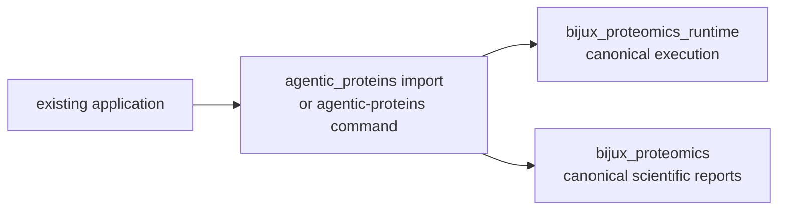

# agentic-proteins

`agentic-proteins` is the compatibility distribution for applications built on
the original execution package. It preserves historical imports, the
`agentic-proteins` command, and legacy HTTP module paths while canonical
implementation lives in `bijux-proteomics-runtime` and, for scientific report
surfaces, `bijux-proteomics-core`.

Install it only when an existing caller still depends on those names:

```bash
python -m pip install agentic-proteins
agentic-proteins --help
```

New applications should install `bijux-proteomics-runtime` and use the
`bijux-proteomics-runtime` command.

## Compatibility flow



The command surfaces are intentionally equivalent. Both currently expose
`run`, `resume`, `compare`, `reproduce`, `inspect-candidate`, `import-result`,
`export-report`, `identity`, and `api`. Forwarding must preserve exit behavior
and output contracts while a caller migrates.

## Migration pattern

Replace legacy modules with their canonical owners:

```python
# Historical
from agentic_proteins.execution.manager import RunManager

# Canonical
from bijux_proteomics_runtime.runs.manager import RunManager
```

Common mappings include:

| Historical family | Canonical family |
| --- | --- |
| `agentic_proteins.execution.*` | `bijux_proteomics_runtime.runs.*` or `bijux_proteomics_runtime.execution.*` |
| `agentic_proteins.orchestration.*` | `bijux_proteomics_runtime.execution.*` and `bijux_proteomics_runtime.runs.*` |
| `agentic_proteins.providers.*` | `bijux_proteomics_runtime.providers.*` |
| `agentic_proteins.state.*` | `bijux_proteomics_runtime.state.*` and `bijux_proteomics_runtime.runs.*` |
| `agentic_proteins.tools.*` | `bijux_proteomics_runtime.execution.tools.*` |
| `agentic_proteins.interfaces.http.*` | `bijux_proteomics_runtime.api.*` |

Use the generated
[canonical migration guide](../09-bijux-proteomics-runtime/migration-ledger/agentic-proteins-canonical-migration-guide.md)
for the exact module-by-module target. Some namespace modules are recorded as
dead rather than wrappers; callers must remove those imports instead of
expecting a replacement.

## Compatibility guarantees

- A bridge module forwards to a declared canonical target and does not own an
  independent implementation.
- New runtime behavior is added to the canonical package first.
- Compatibility regressions are tested against import, CLI, and API contracts.
- Removal requires the compatibility inventory and migration evidence to show
  that supported callers no longer need the path.

The package does not promise permanent preservation of every internal symbol.
Its durable promise is a visible, testable migration route. See the
[compatibility contract](foundation/compatibility-contract.md),
[public imports](interfaces/public-imports.md), and
[known limitations](quality/known-limitations.md) before relying on an
historical surface.

## Documentation map

- [Foundation](foundation/index.md) — role, compatibility contract, scope, and
  dependencies.
- [Architecture](architecture/index.md) — forwarding layout and integration
  seams.
- [Interfaces](interfaces/index.md) — preserved CLI, HTTP, imports, data, and
  artifact contracts.
- [Operations](operations/index.md) — installation, migration, diagnostics, and
  release behavior.
- [Quality](quality/index.md) — invariants, tests, risk, and retirement gates.
