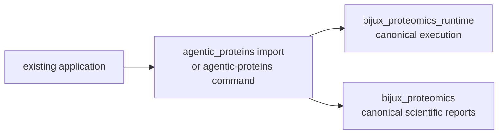
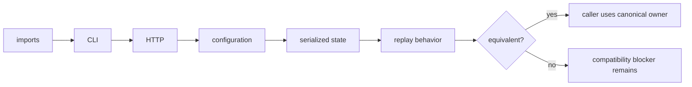

# agentic-proteins

`agentic-proteins` is the compatibility distribution for applications built on
the original execution package. It preserves historical imports, the
`agentic-proteins` command, and legacy HTTP module paths while canonical
implementation lives in `bijux-proteomics-runtime` and, for scientific report
surfaces, `bijux-proteomics-core`.

`agentic-proteins` is the strict compatibility package: it does not compete
with Runtime for ownership of new execution behavior.

Install it only when an existing caller still depends on those names:

```bash
python -m pip install agentic-proteins
agentic-proteins --help
```

New applications should install `bijux-proteomics-runtime` and use the
`bijux-proteomics-runtime` command.

## Do you need this package?

| Caller condition | Install | Migration action |
| --- | --- | --- |
| code imports `agentic_proteins` | `agentic-proteins` and the canonical owner during migration | replace each import using the generated migration guide |
| automation invokes `agentic-proteins` | `agentic-proteins` | compare command output and exit behavior with `bijux-proteomics-runtime` |
| a service imports a historical HTTP module | `agentic-proteins` | move routes and request models to `bijux_proteomics_runtime.api` |
| new code needs execution, providers, replay, or run evidence | `bijux-proteomics-runtime` | use the canonical API directly |
| new code needs scientific report models | `bijux-proteomics-core` | use the Core owner directly |

Compatibility is a caller property, not a second product mode. A deployment
may need the bridge while one historical dependency remains; new components in
that deployment can still use canonical packages directly.

## Compatibility flow



The command surfaces are intentionally equivalent. Both currently expose
`run`, `resume`, `compare`, `reproduce`, `inspect-candidate`, `import-result`,
`export-report`, `identity`, and `api`. Forwarding must preserve exit behavior
and output contracts while a caller migrates.

## Migration pattern

Replace legacy modules with their canonical owners:

```python
# Historical
from agentic_proteins.execution.manager import RunManager

# Canonical
from bijux_proteomics_runtime.runs.manager import RunManager
```

Common mappings include:

| Historical family | Canonical family |
| --- | --- |
| `agentic_proteins.execution.*` | `bijux_proteomics_runtime.runs.*` or `bijux_proteomics_runtime.execution.*` |
| `agentic_proteins.orchestration.*` | `bijux_proteomics_runtime.execution.*` and `bijux_proteomics_runtime.runs.*` |
| `agentic_proteins.providers.*` | `bijux_proteomics_runtime.providers.*` |
| `agentic_proteins.state.*` | `bijux_proteomics_runtime.state.*` and `bijux_proteomics_runtime.runs.*` |
| `agentic_proteins.tools.*` | `bijux_proteomics_runtime.execution.tools.*` |
| `agentic_proteins.interfaces.http.*` | `bijux_proteomics_runtime.api.*` |

Use the generated
[canonical migration guide](../09-bijux-proteomics-runtime/migration-ledger/agentic-proteins-canonical-migration-guide.md)
for the exact module-by-module target. Some namespace modules are recorded as
dead rather than wrappers; callers must remove those imports instead of
expecting a replacement.

## Compatibility guarantees

- A bridge module forwards to a declared canonical target and does not own an
  independent implementation.
- New runtime behavior is added to the canonical package first.
- Compatibility regressions are tested against import, CLI, and API contracts.
- Removal requires the compatibility inventory and migration evidence to show
  that supported callers no longer need the path.

The package does not promise permanent preservation of every internal symbol.
Its durable promise is a visible, testable migration route. See the
[compatibility contract](foundation/compatibility-contract.md),
[public imports](interfaces/public-imports.md), and
[known limitations](quality/known-limitations.md) before relying on an
historical surface.

## Observable parity

Import forwarding is only one compatibility dimension. A migrated caller may
also depend on defaults, exception types, command output, HTTP schemas,
configuration precedence, serialized state, or replay behavior.

| Surface | Equivalent behavior includes |
| --- | --- |
| Python | export, callable signature, default, return type, exception type |
| CLI | command and option names, exit status, stdout, stderr, artifact path |
| HTTP | method, route, request and response schema, status, error envelope |
| configuration | accepted keys, precedence, default, unknown-key response |
| persistence | schema, identity, state transition, resume compatibility |
| execution | provider choice, side effects, refusal, retry, replay semantics |

An intentional difference is recorded as a migration contract. An undocumented
difference is compatibility drift even when both routes complete successfully.

## Migration evidence

Migration is complete only when all depended-on surfaces have been checked:



The migration ledger records module disposition and the validation suite checks
forwarding, command parity, route behavior, configuration, and replay. A module
marked dead has no canonical substitute; remove the dependency rather than
inventing a new bridge.

## Removal evidence

A compatibility module is removable only after repository imports, package
entrypoints, documented examples, serialization contracts, and supported
external callers no longer require it. The module ledger must change with the
source tree, and release communication must name the canonical replacement or
state that no replacement exists.

Passing local bridge tests does not prove caller absence. Removal is therefore
a consumer-evidence decision, not a code-size decision.

## Documentation map

- [Foundation](foundation/index.md) — role, compatibility contract, scope, and
  dependencies.
- [Architecture](architecture/index.md) — forwarding layout and integration
  seams.
- [Interfaces](interfaces/index.md) — preserved CLI, HTTP, imports, data, and
  artifact contracts.
- [Operations](operations/index.md) — installation, migration, diagnostics, and
  release behavior.
- [Quality](quality/index.md) — invariants, tests, risk, and retirement gates.
