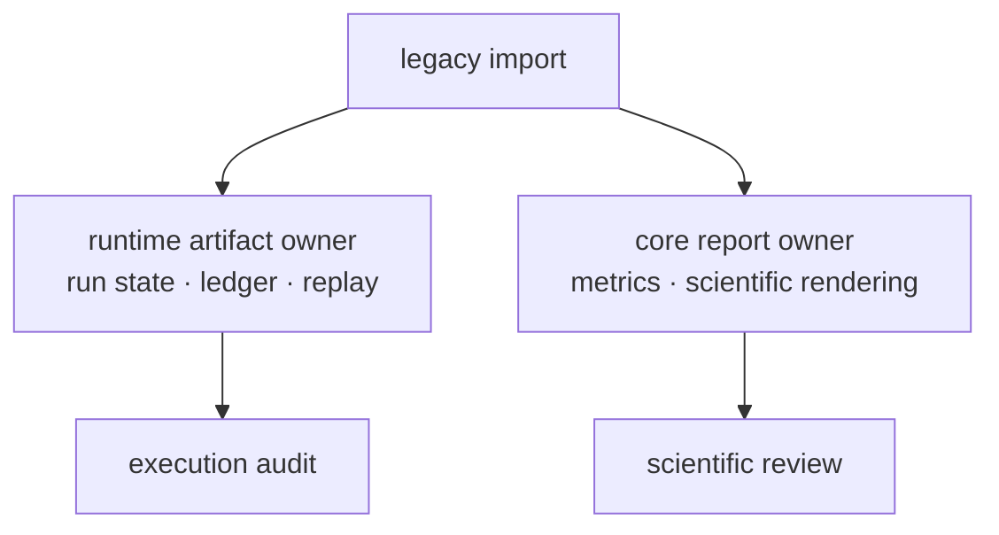

# Compatibility artifact contracts

The compatibility package does not create a second artifact format. Historical
artifact helpers forward to runtime-owned run artifacts, while historical
structure-report helpers forward to core-owned scientific reports.

## Runtime artifacts

`agentic_proteins.execution.artifacts` forwards these canonical runtime
surfaces:

- `ExecutionSnapshots` and `TelemetryHooks` for recorded execution state;
- `write_artifact`, `load_artifact`, and `write_failure_artifacts` for governed
  persistence;
- `compare_runs` for completed-run comparison;
- `require_human_decision` and `validate_human_decision` for review gates;
- `selection_as_dict` and `map_failure_type` for compatibility rendering.

The persisted owner remains `bijux_proteomics_runtime.runs.artifacts`. Run
manifests, checkpoints, artifact ledgers, hashes, telemetry, comparison
reports, and failure records must retain canonical runtime semantics regardless
of which import path invoked them.

## Scientific reports

`agentic_proteins.interfaces.structure_reports` forwards `Metrics`, `Report`,
and rendering helpers from `bijux_proteomics.review.structure_reports`. These
are core scientific report surfaces, not runtime artifacts. Keeping that owner
distinction prevents a report about a structure result from being mistaken for
proof of how the computation executed.

## Migration guarantees

Migrating an import must not rewrite existing artifact content merely because
the module name changed. Consumers should compare canonical serialization,
schema identity, hashes, failure information, and human-decision validation
before removing the bridge dependency.

The bridge does not promise that internal helper names will remain available
forever. In particular, underscore-prefixed forwarded symbols are evidence of
historical coupling and should be removed from consumer code. New artifact
readers and writers belong in the canonical owner.

For artifact lifecycle and replay guarantees, see
[runtime artifact stability](../../09-bijux-proteomics-runtime/runtime-artifact-stability.md).
For the difference between runtime proof and imported scientific results, see
[raw versus import execution](../../09-bijux-proteomics-runtime/raw-versus-import-execution.md).
