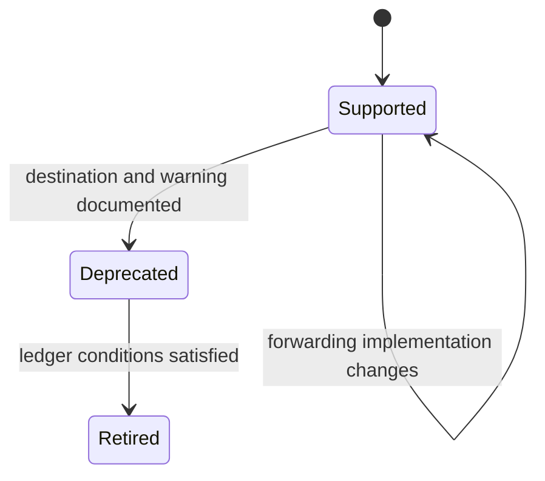

# Compatibility commitments

`agentic-proteins` preserves selected historical entrypoints while ownership
moves through the canonical Proteomics packages. Compatibility means that a
documented legacy route resolves to the same owned behavior; it does not mean
that every historical internal module remains permanent.

The canonical runtime API root is `apis/bijux-proteomics-runtime/v1`. The
compatibility mirror is `apis/agentic-proteins/v1` and must remain traceable to
that canonical contract.

## Supported promises

| Surface | Commitment | Canonical owner |
| --- | --- | --- |
| `agentic_proteins.AppConfig` | lazy forwarding to the runtime configuration contract | Runtime |
| `agentic_proteins.RunManager` | lazy forwarding to the runtime run manager | Runtime |
| `agentic_proteins.cli` | legacy command entrypoint reaches the canonical CLI | Runtime |
| `agentic_proteins.create_app` | application factory reaches the canonical HTTP application | Runtime |
| documented compatibility modules | retain the named import until its migration ledger entry permits retirement | named owner |

Object identity is the strongest bridge guarantee for direct exports: where
the legacy symbol is an alias, it should resolve to the canonical object rather
than a copied implementation. CLI and HTTP compatibility is behavioral because
those surfaces cross process and serialization boundaries.

## What is not promised

Undocumented internal modules, private names, import timing, exception text not
declared by an API contract, and accidental transitive dependencies are not
stable interfaces. The bridge also does not promise independent workflow,
provider, state, persistence, or scientific semantics.

New features belong in canonical packages. Adding them here first would create
two owners and turn migration infrastructure into a permanent fork.

## Compatibility changes

A change is additive only when existing documented calls keep their meaning.
A narrowed route requires migration guidance, test evidence for the new
boundary, and an explicit ledger state. A removed route requires the retirement
condition recorded for that surface to be satisfied; absence from a new README
is not sufficient notice.



Version comparisons must check both sides of the bridge. A passing legacy test
does not establish compatibility if the canonical contract changed, and a
passing canonical test does not prove that old callers still reach it.

## Consumer verification

Consumers can verify the package boundary with the documented root imports and
the CLI/API examples. Maintainers additionally run:

```bash
make test PACKAGE=agentic-proteins
make api PACKAGE=agentic-proteins
make build PACKAGE=agentic-proteins
```

Release notes must name the affected legacy route, its canonical destination,
and whether the promise was preserved, deprecated, narrowed, or retired. That
language lets consumers distinguish a bridge implementation change from a
behavioral change in Runtime or Core.
