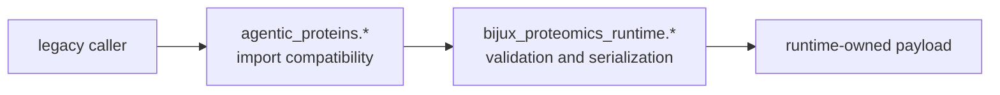

# Compatibility data contracts

`agentic-proteins` preserves historical names for runtime request, execution,
state, and API contracts. It does not maintain an independent schema model.
Objects imported through the bridge are the canonical runtime objects, so
validation and serialization behavior come from `bijux-proteomics-runtime`.

## Contract mapping

| Legacy path | Canonical owner | Contract family |
| --- | --- | --- |
| `agentic_proteins.execution.schemas` | `bijux_proteomics_runtime.execution.schemas` | execution traces and workflow execution payloads |
| `agentic_proteins.state.schemas` | `bijux_proteomics_runtime.state.schemas` | artifact metadata, confidence items, and state snapshots |
| `agentic_proteins.execution.run_config` | `bijux_proteomics_runtime.runs.run_config` | run configuration and execution-mode choices |
| `agentic_proteins.execution.evaluation.schemas` | `bijux_proteomics_runtime.execution.evaluation.schemas` | evaluation observations and results |
| `agentic_proteins.tools.schemas` | `bijux_proteomics_runtime.execution.tools.schemas` | tool requests, responses, and failure data |
| `agentic_proteins.interfaces.http.v1.schema` | `bijux_proteomics_runtime.api.v1.schema` | HTTP request and response models |

Because forwarding modules re-export canonical definitions, an instance does
not acquire a separate compatibility type identity. This is important for
Pydantic validation, equality, exception handling, and serialized documents.

## HTTP schema parity

The tracked compatibility API contract lives under
`apis/agentic-proteins/v1/`; the canonical contract lives under
`apis/bijux-proteomics-runtime/v1/`. Each contains a pinned OpenAPI document,
a reviewable YAML schema, and a schema hash. Compatibility changes must be
checked against both roots so an apparently harmless runtime evolution does
not break legacy clients silently.

Schema parity does not mean permanent equality. A canonical API can add new
behavior that is not promised through the bridge. Any intentional divergence
requires an explicit compatibility decision and migration route.

## Stability boundary

- Public bridge imports must resolve to a declared canonical target.
- Field validation, defaults, enum values, and JSON behavior are owned by the
  canonical module.
- Private names forwarded for historical reasons are migration liabilities,
  not newly supported API.
- Dead namespace modules do not define data contracts and must not gain them.
- New consumers should import canonical types directly.

Use the
[canonical migration guide](../../09-bijux-proteomics-runtime/migration-ledger/agentic-proteins-canonical-migration-guide.md)
to resolve a specific module and the
[runtime CLI reference](../../09-bijux-proteomics-runtime/cli-reference.md) for
the maintained operator surface.
