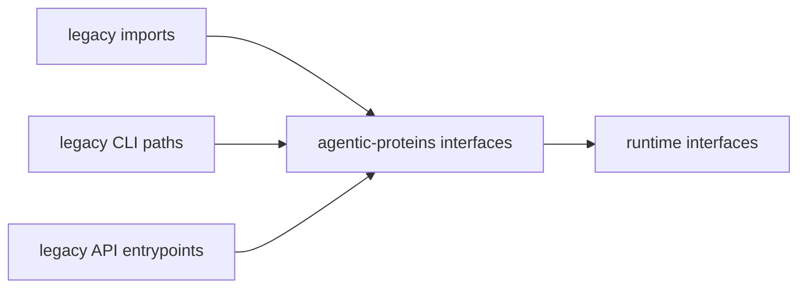

# Interfaces

`agentic-proteins` interfaces should tell a reader exactly which public surfaces are real, which are only compatibility bridges, and which nearby package actually owns the next step.

The canonical runtime API root is `apis/bijux-proteomics-runtime/v1`; the compatibility mirror root is `apis/agentic-proteins/v1`.

## What Makes This Section Useful

- it distinguishes preserved access paths from canonical runtime ownership
- it helps readers avoid treating a shim as the true long-term interface
- it makes compatibility promises visible enough to review and retire

## Start With

- open [Public Imports](https://bijux.io/bijux-proteomics/02-agentic-proteins/interfaces/public-imports/) when the question starts from code
- open [Data Contracts](https://bijux.io/bijux-proteomics/02-agentic-proteins/interfaces/data-contracts/) when the question is really about payload meaning or compatibility
- open [Compatibility Commitments](https://bijux.io/bijux-proteomics/02-agentic-proteins/interfaces/compatibility-commitments/) before changing any documented public promise

## Section Pages

- [Public Imports](https://bijux.io/bijux-proteomics/02-agentic-proteins/interfaces/public-imports/)
- [Data Contracts](https://bijux.io/bijux-proteomics/02-agentic-proteins/interfaces/data-contracts/)
- [Artifact Contracts](https://bijux.io/bijux-proteomics/02-agentic-proteins/interfaces/artifact-contracts/)
- [API Surface](https://bijux.io/bijux-proteomics/02-agentic-proteins/interfaces/api-surface/)
- [CLI Surface](https://bijux.io/bijux-proteomics/02-agentic-proteins/interfaces/cli-surface/)
- [Configuration Surface](https://bijux.io/bijux-proteomics/02-agentic-proteins/interfaces/configuration-surface/)
- [Entrypoints and Examples](https://bijux.io/bijux-proteomics/02-agentic-proteins/interfaces/entrypoints-and-examples/)
- [Operator Workflows](https://bijux.io/bijux-proteomics/02-agentic-proteins/interfaces/operator-workflows/)
- [Compatibility Commitments](https://bijux.io/bijux-proteomics/02-agentic-proteins/interfaces/compatibility-commitments/)

## What This Package Publishes

- legacy imports, CLI paths, API entrypoints, and runtime-facing compatibility artifacts

## What This Section Settles

- which public surfaces are still intentionally preserved
- which compatibility promises are strong enough to document
- where a reader should go once the question stops being about legacy access

## First Proof Check

- `src/agentic_proteins/interfaces/cli.py`
- `src/agentic_proteins/api/app.py`
- `packages/agentic-proteins/tests`
