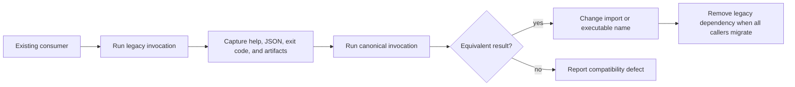

# Compatibility operator workflow

The compatibility package supports one operational job: keep an existing
`agentic-proteins` consumer working while ownership moves to
`bijux-proteomics-runtime`. It should never create a second run history or a
second interpretation of runtime state.

## Migrate an executable safely

1. Record the exact legacy command, working directory, input, and artifact
   location. Relative paths are interpreted from the runtime workspace.
2. Run it once with `--json` and preserve the exit code and emitted artifact
   hashes. For execution commands, use `--dry-run` first when provider cost or
   availability is uncertain.
3. Replace only `agentic-proteins` with `bijux-proteomics-runtime`; do not alter
   options in the same review.
4. Compare the JSON envelope, run identifier behavior, artifact paths, and
   error response. Help output must also remain identical.
5. Change imports from `agentic_proteins` to their canonical runtime modules,
   then rerun the consumer's integration tests.

## Interpret a mismatch

- A missing or renamed command is CLI contract drift.
- Different `RunConfig` defaults are configuration drift.
- Different FastAPI routes or `AppConfig` behavior are transport drift.
- Different output or artifact hashes require scientific and runtime review;
  do not dismiss them as a package rename.
- A missing optional provider dependency is an environment failure, not a
  reason to add behavior to the compatibility package.

Compatibility code may forward a canonical capability, but it must not add a
legacy-only provider, state store, retry policy, or output format. New runtime
features belong in the canonical package and become visible through forwarding
only when preserving the public contract is intentional.

For the detailed ownership map and removal criteria, use the
[canonical migration guide](../../09-bijux-proteomics-runtime/migration-ledger/agentic-proteins-canonical-migration-guide.md).
