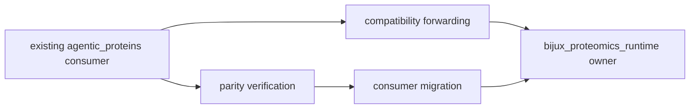

# Common Workflows

`agentic-proteins` is a compatibility bridge to
`bijux-proteomics-runtime`. Use it to keep established consumers working while
moving imports and entrypoints toward the canonical Runtime owner. New runtime
capabilities belong in Runtime, not in the bridge.



## Verify A Root Import

The supported root names are `AppConfig`, `RunManager`, `cli`, and
`create_app`. Confirm that the compatibility and canonical paths resolve to the
same object:

```python
from agentic_proteins import RunManager as CompatibilityRunManager
from bijux_proteomics_runtime import RunManager

assert CompatibilityRunManager is RunManager
```

Identity matters: a copied wrapper with similar behavior would create a second
runtime contract.

## Migrate A Consumer

1. Inventory the consumer's root and nested `agentic_proteins` imports.
2. Map each path through [Public Imports](../interfaces/public-imports.md).
3. Replace imports with their `bijux_proteomics_runtime` owner paths.
4. Run the consumer's behavior, serialization, error, and lifecycle tests.
5. Remove the bridge dependency only after no supported compatibility path is
   used.

Do not combine import migration with policy or schema changes. A path-only
migration should preserve object identity, defaults, exceptions, state
transitions, and emitted artifacts.

## Preserve The Legacy CLI

The `agentic-proteins` console command forwards to the canonical Runtime CLI.
Use it for established automation while migration is in progress:

```bash
agentic-proteins --help
```

Compare help text, exit status, output, and failure behavior against the
canonical command for the same installed versions. Add new commands and options
to Runtime first; compatibility exposure must remain a forwarding decision.

## Preserve HTTP Construction

`agentic_proteins.interfaces.http.app` forwards the application surface to
Runtime. Verify application construction, route inventory, dependency wiring,
middleware, and structured errors before changing a consumer import. The bridge
does not own an independent service lifecycle.

## Diagnose A Compatibility Failure

| Symptom | Check |
| --- | --- |
| root symbol missing | supported four-name root contract and installed versions |
| nested import missing | public import ledger and compatibility inventory |
| object identity differs | accidental wrapper or copied implementation |
| CLI differs | distribution entrypoint and Runtime CLI version |
| state or artifact differs | Runtime lifecycle and serialization evidence |
| provider behavior differs | canonical Runtime provider configuration and optional dependencies |

## Retirement Evidence

A compatibility path is eligible for retirement only when usage evidence,
consumer migration, release communication, and failure behavior are complete.
Removal must not be inferred from low repository-local usage: external
consumers are the reason the bridge exists.
