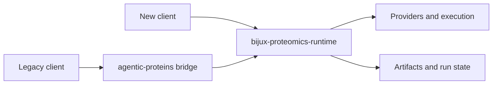

# Deployment Boundaries

`agentic-proteins` is deployable as a Python distribution, but it is not a second execution platform. Its CLI, HTTP, orchestration, provider, state, and tool modules forward to canonical owners so existing deployments can migrate without a flag day.



## Supported deployment posture

Keep the bridge in an environment when removing it would break an existing import, command, HTTP integration, serialized reference, or operational script. Pin the compatibility and canonical packages to the same supported release family, exercise the historical entrypoint during rollout, and monitor the canonical Runtime behavior it reaches.

The legacy command is a continuity surface:

```bash
agentic-proteins --help
```

The preferred operational command remains:

```bash
bijux-proteomics-runtime --help
```

For HTTP use, `agentic_proteins.interfaces.http.app` forwards the canonical Runtime application surface. Deployment configuration, process supervision, health checks, request limits, credentials, and network policy therefore belong to Runtime and the hosting environment—not to a parallel compatibility service definition.

## Release topology

Treat the bridge and Runtime as one compatibility set:

- upgrade them together within the declared dependency range;
- test the historical entrypoint and its canonical equivalent against the same request or fixture;
- compare emitted artifacts and failure behavior, not only exit status;
- retain a rollback that restores the previous pair rather than downgrading one package independently.

A container may include `agentic-proteins` for a legacy consumer, but the image should have one execution owner. Do not run separate bridge and Runtime services as if they were independent control planes.

## Prohibited ownership drift

Do not add bridge-specific queues, databases, caches, provider selection policy, retry logic, telemetry semantics, or workflow state. Those changes would create deployment behavior that exists only when the legacy package is installed. Implement the behavior in Runtime, then forward it only when compatibility requires the old name.

## Exit condition

A deployment no longer needs the bridge when its code, commands, health checks, and automation refer only to canonical Runtime paths. Remove `agentic-proteins` in a controlled release and rerun the same operational verification. Successful removal is the strongest evidence that compatibility has not become hidden infrastructure.
