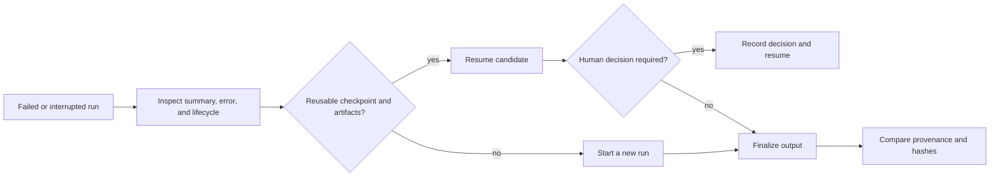

# Failure Recovery

Agentic Proteins exposes the canonical runtime recovery path through its CLI and
HTTP compatibility surfaces. Recovery therefore follows the persisted run
contract: inspect the failed run, decide whether its evidence is reusable, and
resume or reproduce through the runtime rather than editing artifacts by hand.

## Choose the recovery action

| Condition | Action | Why |
| --- | --- | --- |
| Run stopped at a persisted human-review boundary | Use `resume` with the recorded candidate decision | The checkpoint preserves candidate evidence and parent-run lineage. |
| Input, configuration, or provider choice was wrong | Start a new run with corrected inputs | Changing the meaning of an existing run would invalidate its provenance. |
| An external engine already produced a result | Use `import-result` | The import contract records the engine and source without claiming the runtime produced them. |
| A completed run must be independently checked | Use `reproduce` | Reproduction runs in a separate artifact root and compares artifact hashes. |
| Integrity verification reports missing, oversized, or changed artifacts | Quarantine the bundle and start a new run | A checkpoint is not authority to reuse corrupted evidence. |

## Recover a review-held candidate

Read the run summary and `resume_checkpoint.json` together. Confirm the run is
in `human_review`, the candidate identifier matches the checkpoint, and the
artifact integrity report passes. Record the human decision through the
supported interface, then invoke `resume`; the resulting run retains the parent
run identifier and increments resume depth.

Do not convert `partial` to `success` manually. A partial result can mean dry-run
execution or unresolved human review, and downstream consumers rely on that
distinction. Keep the original run directory immutable during diagnosis. A new
attempt receives its own run identity, summary, timings, ledger, and replay
contract, which makes comparison possible without erasing the failure.

## Confirm recovery

Recovery is complete only when the new run has a terminal lifecycle state, its
summary agrees with `run_output.json`, and the artifact ledger passes integrity
verification. Compare provider versions, plan fingerprint, warnings, QC status,
and coordinator decision with the original. A successful process exit alone is
not sufficient evidence of scientific equivalence.
