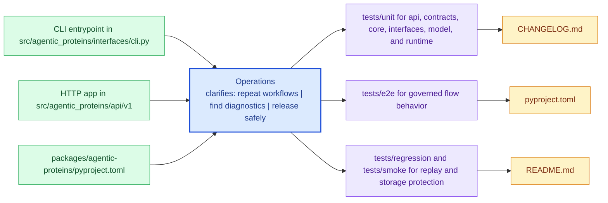

# Operations

This section explains how to install, run, diagnose, and release `agentic-proteins` from checked-in workflow guidance instead of team memory.

These pages are the checked-in operating memory for `agentic-proteins`. They should let a maintainer move from setup to diagnosis to release without relying on CI archaeology or private habits.

Treat the operations pages for `agentic-proteins` as the package's explicit operating memory. They should make common tasks repeatable without relearning the workflow from logs or oral history.

## Visual Summary

## Pages in This Section

- [Installation and Setup](installation-and-setup.md)
- [Local Development](local-development.md)
- [Common Workflows](common-workflows.md)
- [Observability and Diagnostics](observability-and-diagnostics.md)
- [Performance and Scaling](performance-and-scaling.md)
- [Failure Recovery](failure-recovery.md)
- [Release and Versioning](release-and-versioning.md)
- [Security and Safety](security-and-safety.md)
- [Deployment Boundaries](deployment-boundaries.md)

## Read Across the Package

- [Foundation](../foundation/index.md) when you need the package boundary and ownership story first
- [Architecture](../architecture/index.md) when the question becomes structural, modular, or execution-oriented
- [Interfaces](../interfaces/index.md) when the question becomes caller-facing, schema-facing, or contract-facing
- [Quality](../quality/index.md) when the question becomes proof, risk, trust, or review sufficiency

## Concrete Anchors

- `packages/agentic-proteins/pyproject.toml` for package metadata
- `packages/agentic-proteins/README.md` for local package framing
- `packages/agentic-proteins/tests` for executable operational backstops

## Use This Page When

- you are installing, running, diagnosing, or releasing the package
- you need repeatable operational anchors rather than architectural framing
- you are responding to package behavior in local work, CI, or incident pressure

## Decision Rule

Use `Operations` to decide whether a maintainer can repeat the package workflow from checked-in assets instead of memory. If a step works only because someone already knows the trick, the workflow is not documented clearly enough yet.

## What This Page Answers

- how `agentic-proteins` is installed, run, diagnosed, and released in practice
- which checked-in files and tests anchor the operational story
- where a maintainer should look first when the package behaves differently

## Reviewer Lens

- verify that setup, workflow, and release statements still match package metadata and current commands
- check that operational guidance still points at real diagnostics and validation paths
- confirm that maintainer advice still works under current local and CI expectations

## Honesty Boundary

This page explains how `agentic-proteins` is expected to be operated, but it does not replace package metadata, actual runtime behavior, or validation in a real environment. A workflow is only trustworthy if a maintainer can still repeat it from the checked-in assets named here.

## Next Checks

- move to interfaces when the operational path depends on a specific surface contract
- move to quality when the question becomes whether the workflow is sufficiently proven
- move back to architecture when operational complexity suggests a structural problem

## Purpose

This page explains how to use the operations section for `agentic-proteins` without repeating the detail that belongs on the topic pages beneath it.

## Stability

This page is part of the canonical package docs spine. Keep it aligned with the current package boundary and the topic pages in this section.
