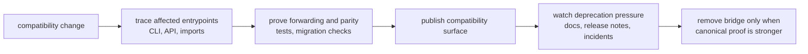

# Operations

`agentic-proteins` operations is about preserving trust while the compatibility
surface keeps getting less important. A maintainer working in this package
should always be asking two questions: did we preserve old callers, and did we
avoid rebuilding new authority here?

## The Operating Job

- keep legacy callers working without letting the package become the preferred
  home for new work
- treat migration proof as part of operations, not as optional background
  paperwork
- make release decisions based on compatibility evidence, not just passing
  package-local tests

## Start With

- open [Common Workflows](https://bijux.io/bijux-proteomics/02-agentic-proteins/operations/common-workflows/)
  when you need the expected path from edit to proof
- open [Local Development](https://bijux.io/bijux-proteomics/02-agentic-proteins/operations/local-development/)
  when you are actively changing forwarding behavior or compatibility tests
- open [Release and Versioning](https://bijux.io/bijux-proteomics/02-agentic-proteins/operations/release-and-versioning/)
  before deciding that a compatibility change is publishable
- open [Failure Recovery](https://bijux.io/bijux-proteomics/02-agentic-proteins/operations/failure-recovery/)
  when callers are already seeing drift between legacy and canonical behavior

## Route From Symptom

- [Installation and Setup](https://bijux.io/bijux-proteomics/02-agentic-proteins/operations/installation-and-setup/)
  for reproducible local entrypoint testing
- [Observability and Diagnostics](https://bijux.io/bijux-proteomics/02-agentic-proteins/operations/observability-and-diagnostics/)
  for evidence that a legacy surface diverged
- [Deployment Boundaries](https://bijux.io/bijux-proteomics/02-agentic-proteins/operations/deployment-boundaries/)
  and [Security and Safety](https://bijux.io/bijux-proteomics/02-agentic-proteins/operations/security-and-safety/)
  for the rules that stop compatibility from becoming a policy loophole
- [Performance and Scaling](https://bijux.io/bijux-proteomics/02-agentic-proteins/operations/performance-and-scaling/)
  only when the bridge itself is the bottleneck rather than the canonical
  runtime behind it

## What Good Looks Like Here

- compatibility preservation is measurable
- migration validation stays close to every release decision
- retirement pressure remains visible in docs, release notes, and review

## First Proof Check

- `src/agentic_proteins/interfaces/cli.py` and `interfaces/http/app.py`
- `src/agentic_proteins/execution/`, `state/`, and `providers/`
- `packages/agentic-proteins/tests`
