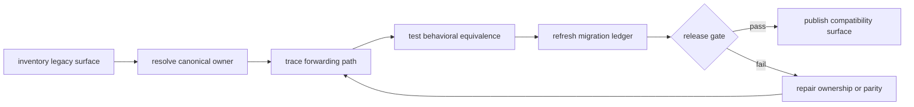
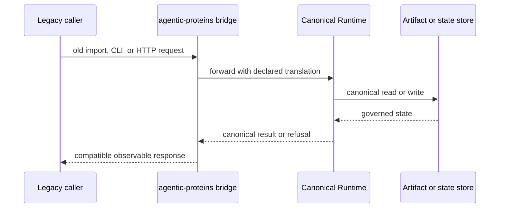

# Operating the compatibility bridge

Operating `agentic-proteins` means proving two properties together: supported
legacy callers still observe their contracted behavior, and all live behavior
continues to belong to its canonical package. Package-local tests alone cannot
establish either property.

## Classify before changing

Begin with the governed
[compatibility inventory](../../09-bijux-proteomics-runtime/migration-ledger/agentic-proteins-compatibility-inventory.md),
not a directory name or remembered ownership. For each affected module, record:

1. the legacy import or executable surface;
2. its `wrapper` or `dead` disposition;
3. the exact canonical target;
4. the compatibility dimensions exposed to callers;
5. the test and ledger evidence that support the classification.

If the module contains an implementation, owns mutable policy, or forwards to
another compatibility module, stop the release path. Move the behavior to its
canonical owner and reduce the legacy module to a direct bridge.

## Trace a legacy caller

Follow the caller from public entrypoint to final owner. A complete trace names
the old surface, adapter, canonical callable, configuration source, state or
artifact touched, and the returned failure or result contract.

The [execution model](../architecture/execution-model.md) explains forwarding
internals. [Observability and diagnostics](observability-and-diagnostics.md)
lists the signals needed to locate divergence.

## Prove equivalence by surface

| Surface | Minimum comparison |
| --- | --- |
| Python | import path, exports, signature, defaults, return type, exception type |
| CLI | command tree, option parsing, exit code, stdout, stderr, artifact path |
| HTTP | method and path, request schema, response schema, status code, error envelope |
| configuration | accepted keys, defaults, precedence, unknown-key behavior |
| state | schema, transition, identity, persistence, resume behavior |
| execution | selected provider or tool, side effects, refusal, retry and replay semantics |

Compare the legacy and canonical routes with the same fixtures. Assert both
successful and negative paths; a wrapper that preserves the happy path but
changes refusal, validation, or partial-failure behavior is not equivalent.

[Common workflows](common-workflows.md) gives the change-to-proof sequence;
[local development](local-development.md) provides focused commands.

## Diagnose compatibility drift

| Symptom | Likely boundary | Inspect first |
| --- | --- | --- |
| import fails or symbol is missing | export forwarding | module ledger and public import tests |
| CLI output or exit status differs | command adapter | legacy and Runtime CLI tests |
| HTTP response changes | transport adapter | route schema, middleware, error mapping |
| resumed run differs | state or serialization | snapshot schema and replay evidence |
| provider selection differs | configuration or capability forwarding | resolved configuration and selection trace |
| only the bridge succeeds | shadow behavior | local definitions and canonical ownership |

Do not patch drift by adding independent logic to the bridge. Repair the
canonical implementation when it is wrong, or repair direct forwarding when
the bridge is wrong, then prove both routes again.

## Handle dead modules

A `dead` classification means no meaningful behavior remains; it does not by
itself authorize deletion. Search repository imports, tests, packaging
metadata, command registration, documentation, and supported downstream usage.
Remove the module only when absence is demonstrated and the migration ledger
and release notes can change in the same release boundary.

If callers remain, preserve an explicit import failure or forwarding path as
required by the compatibility contract. Do not leave a deceptive namespace
that imports successfully but exposes incomplete behavior.

## Release gate

A compatibility release is ready only when:

- every shipped module is classified as `wrapper` or `dead`;
- every wrapper names a canonical owner and contains no local product logic;
- no canonical package depends on `agentic-proteins`;
- import, CLI, HTTP, configuration, state, and replay parity are tested where
  those surfaces exist;
- inventories and migration guidance match the shipped tree;
- removals have caller-absence evidence and a published replacement.

Run `make quality-runtime-migration-validation` as the repository-wide gate.
Use [release and versioning](release-and-versioning.md) for publication rules
and [failure recovery](failure-recovery.md) when a released bridge has already
diverged. A failing migration gate is release evidence, not a warning to waive.
