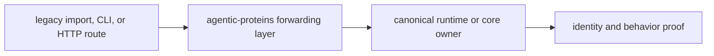

# Local development

`agentic-proteins` is a compatibility bridge, not a second workflow runtime.
Local work therefore begins by identifying the canonical owner in
`bijux-proteomics-runtime` or `bijux-proteomics-core`, then proving that the
legacy route still forwards to that owner without acquiring new behavior.

## Prepare the repository environment

Run package commands from the repository root. The dispatcher installs the
package, its canonical dependencies, and the shared development toolkit into
the repository check environment.

```bash
make lint PACKAGE=agentic-proteins
make test PACKAGE=agentic-proteins
make quality PACKAGE=agentic-proteins
make api PACKAGE=agentic-proteins
```

Use `make build PACKAGE=agentic-proteins` when packaging metadata, forwarding
modules, or included artifacts change. Generated reports and distributions are
written beneath `artifacts/`; they do not belong beside source files.

## Follow the ownership route



For a root import, compare `src/agentic_proteins/__init__.py` with the public
exports of `bijux_proteomics_runtime`. For CLI or HTTP work, inspect
`interfaces/cli.py` or `interfaces/http/app.py` and the canonical entrypoint it
delegates to. Provider, execution, state, and persistence behavior belongs to
Runtime even when a historical module still exposes the old path.

## Choose the smallest meaningful proof

| Change | Required evidence |
| --- | --- |
| lazy root export | imported object is the canonical object, including identity where promised |
| CLI forwarding | legacy invocation reaches the canonical command and preserves exit semantics |
| HTTP forwarding | route, schema, status, and error behavior match the canonical API contract |
| package metadata | canonical dependencies install and wheel/sdist contents remain bridge-only |
| deprecation text | migration destination and retirement state agree with the migration ledger |

Run the narrow test module while editing, then the package test and API gates
before committing. A test that only proves the bridge imports is insufficient
when the change affects a callable route.

## Keep the bridge narrow

Do not add local policy, retries, provider selection, state transitions, or
artifact interpretation to make an old caller easier to support. Put the
behavior in its canonical owner and forward to it. If an old signature cannot
map exactly, expose the incompatibility through a documented migration or an
explicit error instead of silently changing meaning.

The change is ready when the canonical owner contains the behavior, the bridge
contains only adaptation or forwarding, legacy and canonical routes agree, and
the compatibility ledger describes any narrowed promise.
