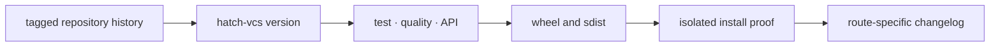

# Release and versioning

`agentic-proteins` follows the coordinated package-family release identity.
The version is resolved from Git tags through `hatch-vcs`.
A `v<version>` tag identifies the source revision shared with the coordinated
package family. The fallback value in package metadata supports
source archives that lack repository history; it is not an independent release
authority. The package does not maintain a separate semantic clock for bridge
behavior.

## How to read a release

For this package, the most important release fact is the state of each legacy
route. A release can preserve the bridge while canonical Runtime gains new
features, or it can change migration posture without changing runtime behavior.
The package changelog must separate those events.

| Change | Release evidence |
| --- | --- |
| forwarding implementation | legacy and canonical identity or behavior tests |
| dependency floor | clean installation with the released canonical packages |
| deprecated route | migration destination, warning behavior, and ledger entry |
| retired route | satisfied retirement condition and removal proof |
| API mirror | canonical and compatibility schema comparison |

## Release proof chain



Before a release candidate is trusted, run the package test, quality, API, and
build gates from the repository root:

```bash
make test PACKAGE=agentic-proteins
make quality PACKAGE=agentic-proteins
make api PACKAGE=agentic-proteins
make build PACKAGE=agentic-proteins
```

The build gate creates the wheel and source distribution under `artifacts/`
and validates their metadata. Publication tooling additionally resolves the
version, rejects disallowed local or prerelease versions, checks both
distribution formats, and runs `twine check` before upload is possible.

## Coordinated compatibility

Release review includes the canonical packages named by bridge dependencies.
If Runtime changes an entrypoint forwarded by Agentic Proteins, the bridge
proof belongs in the same release decision even when no bridge source changed.
Likewise, changing the bridge dependency floor without verifying the lowest
supported canonical versions leaves the compatibility claim unproven.

Update `packages/agentic-proteins/CHANGELOG.md` with the consumer-visible route,
its destination, and its migration state. Do not describe a forwarding-only
change as a new Agentic capability. New execution or scientific behavior is
reported under its canonical owner.

After publication, verify installation from the published index in an empty
environment, import the documented root symbols, and exercise at least one
forwarded command or application route. A successful upload is transport
evidence; the isolated invocation is consumer evidence.
