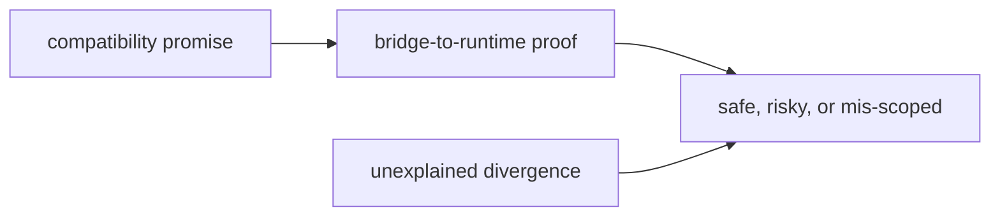

# Change Validation

Change validation should make it obvious whether a package edit is safe, risky, or mis-scoped.

## Validation Model

This page should make bridge validation concrete. A change is safe only when a
reviewer can tell whether the compatibility promise was preserved, narrowed, or
retired and can see the proof close to the runtime surface it forwards into.

## Review Rules

- every change should say whether it preserves, narrows, or retires a compatibility promise
- run the closest bridge-to-runtime proof before accepting the edit
- treat unexplained divergence from runtime as a failed validation

## First Proof Check

- `packages/agentic-proteins/tests`
- `src/agentic_proteins/interfaces/cli.py` and `api/app.py`
- `src/agentic_proteins/runtime/`

## Design Pressure

Bridge changes become sloppy when “still works” replaces an explicit account of
what promise survived and what changed. Validation has to keep retirement
pressure and runtime alignment visible at the same time.
