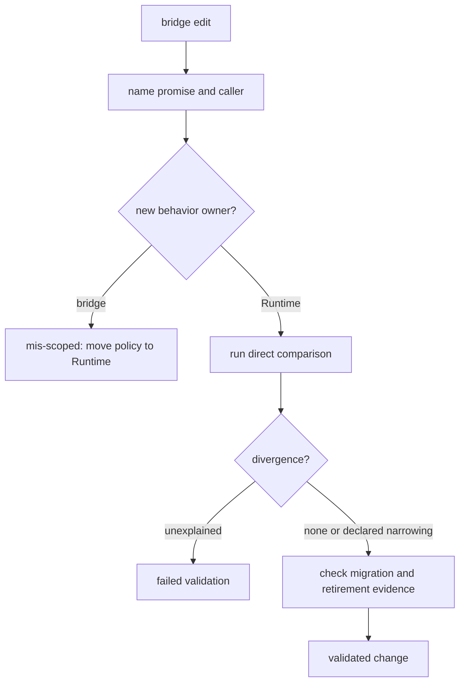

# Change validation

Classify every bridge change as preserving, narrowing, or retiring a named
compatibility promise. A change that introduces bridge-owned behavior is
mis-scoped even when every legacy test passes.

## Validation matrix

| Change | Focused validation | Wider review |
| --- | --- | --- |
| forwarded export | object identity, import path, `__all__`, unavailable dependency | canonical Runtime public API and external caller |
| CLI command | arguments, defaults, exit codes, stdout/stderr, errors, artifacts | Runtime CLI and migration guidance |
| HTTP endpoint | request schema, status, response, middleware, failure mapping | Runtime HTTP contract and clients |
| execution or orchestration alias | state transitions, resume, cancellation, artifacts, telemetry | Runtime lifecycle and persistence |
| provider or tool | capability selection, dependency isolation, timeout, error, fallback | Runtime provider policy and optional extras |
| compatibility removal | caller inventory, replacement proof, release metadata, absence test | retirement budget and public migration record |

## Validation decision

Inspect both the legacy result and the canonical result. Compare object
identity where promised; otherwise compare public fields, ordering, terminal
state, errors, warnings, and artifacts. Include at least one negative path.

## Required record

State the compatibility promise, remaining caller, Runtime owner, comparison
method, negative case, exact checks, and effect on retirement. For a narrowed
or removed surface, state the replacement and evidence that affected callers
can move. “Still works” is not a validation result.
