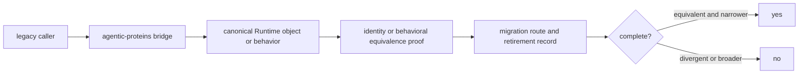

# Definition of done

A compatibility change is complete only when an established caller still sees
the promised behavior, the canonical Runtime owner remains visible, and the
change does not create a new reason to depend on `agentic-proteins`.

## Completion gate

| Changed surface | Completion evidence | Blocking result |
| --- | --- | --- |
| top-level import | forwarded objects retain identity with the Runtime export | a copied or independently implemented object replaces forwarding |
| CLI or HTTP route | request, response, exit, and error behavior agree with Runtime | the bridge invents a default, status, or error translation |
| execution or orchestration alias | state transitions and artifacts remain equivalent | bridge-only lifecycle or artifact meaning appears |
| provider or tool path | capability, isolation, and failure behavior remain explicit | optional provider failure changes the canonical run contract |
| public signature | legacy callers remain compatible and the Runtime alternative is documented | compatibility is preserved only through an undocumented coercion |
| retirement record | remaining callers and removal conditions are still measurable | the change adds an unowned permanent obligation |

## Evidence path

Start with the proof closest to the changed promise:

- `tests/package/test_runtime_forwarding_import_contract.py` for top-level
  Runtime identity;
- `tests/package/test_import_forwarding.py` and
  `test_bridge_contracts.py` for forwarding and retirement contracts;
- `tests/interfaces/` and `tests/integration/test_cli.py` for public transport
  behavior;
- `tests/orchestration/test_run_invariants.py` and
  `tests/integration/test_artifact_first.py` for run and artifact meaning;
- `tests/providers/` for optional-provider isolation and failure semantics.

Run package checks after focused proof. A green package suite cannot justify a
new bridge-owned policy; it only shows that the tested compatibility surface
still behaves as declared.

## Not complete

A change is not complete when it keeps an old entry point running by duplicating
Runtime behavior, makes the migration destination less obvious, converts an
explicit Runtime refusal into bridge fallback, or leaves removal dependent on
an unnamed caller. Compatibility is a bounded obligation, not permission to
grow a parallel product.
