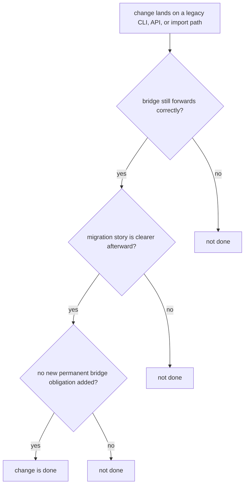

# Definition of Done

Done means the package is easier to trust after the change, not just that the diff merged.

For `agentic-proteins`, done means a legacy surface still forwards correctly, becomes easier to retire, and does not quietly grow into a second runtime.

## Completion Model

This page should make completion feel stricter than “legacy path still works.” The bridge is only safer after a change when the runtime handoff and retirement pressure are both easier to explain.

## Review Rules

- the edited legacy surface still forwards correctly
- the migration story is clearer than before the change
- no new permanent bridge obligation was added by accident

## First Proof Check

- `packages/agentic-proteins/tests`
- `src/agentic_proteins/interfaces/cli.py` and `interfaces/http/app.py`
- `src/agentic_proteins/execution/` and `src/agentic_proteins/state/`

## Design Pressure

The easy failure is to declare success once a legacy entrypoint still runs, even though the bridge just became broader or harder to retire.
