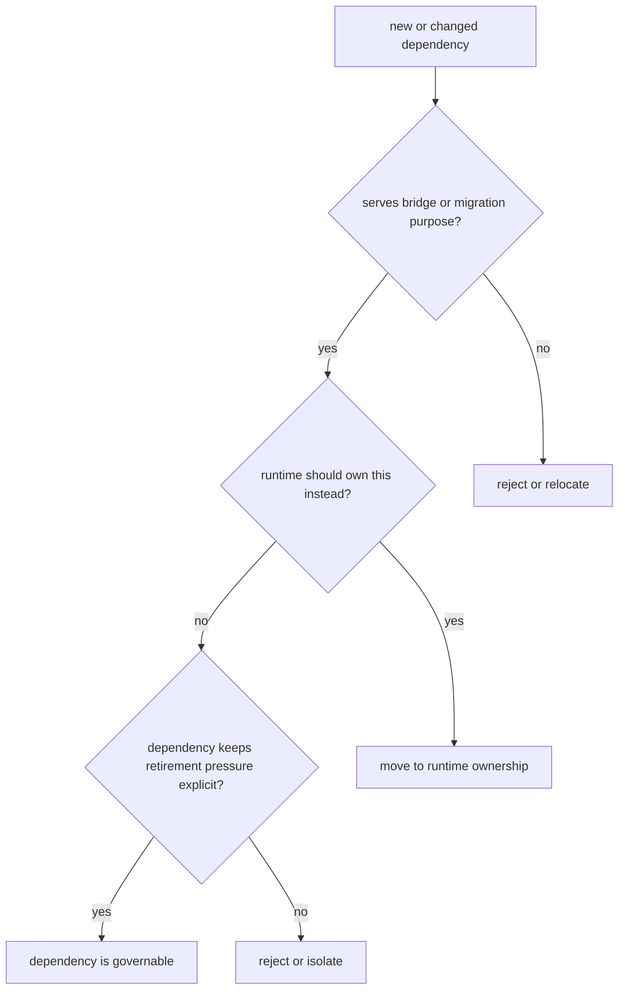

# Dependency Governance

Dependency governance is really boundary governance under another name.

For `agentic-proteins`, a dependency is acceptable only when it supports compatibility proof or retirement work without binding modern runtime ownership more tightly to the bridge.

## Governance Model

The bridge may depend on what is necessary to forward and validate historical
behavior. It must not become the installation route for a capability owned by
Runtime or another modern package.

## Dependency decision record

| Question | Acceptable evidence | Refuse or relocate when |
| --- | --- | --- |
| Which compatibility surface needs it? | named import, CLI, HTTP, state, or replay contract | justification is general convenience |
| Why can the canonical owner not provide it? | dependency is required only to decode or forward a historical surface | the dependency implements current execution or science |
| What installation cost does it add? | lock diff, wheel impact, optional-extra posture, and vulnerability review | every bridge user inherits an unrelated heavy dependency |
| How does retirement remove it? | caller ledger entry and deletion condition | no path exists to remove the dependency with the bridge |
| Does it reverse dependency direction? | package graph remains canonical-owner outward | a modern package must import the bridge |

A compatibility-only dependency has a deletion condition. Without one, the
change is an ownership expansion rather than bridge maintenance.

## Review rules

- require a migration or compatibility contract, not a feature rationale;
- keep modern packages independent of `agentic-proteins`;
- place execution providers, state engines, and protocol implementations in
  Runtime;
- prefer optional decoding support when only a subset of historical callers
  needs the dependency;
- pair removal of the last caller with removal of its bridge-only dependency.

## First proof route

Inspect the dependency declaration and lock change, then trace its imports from
`packages/agentic-proteins/src/agentic_proteins/`. Confirm the dependency is
exercised by compatibility tests and absent from reverse imports in canonical
packages. Security and license checks remain mandatory even when the
dependency is short-lived.

## Design Pressure

The common drift is a helper that reduces forwarding code while quietly
creating a new reason to install the bridge. The durable response is to move
the capability to its canonical owner and keep only the narrow adapter.
