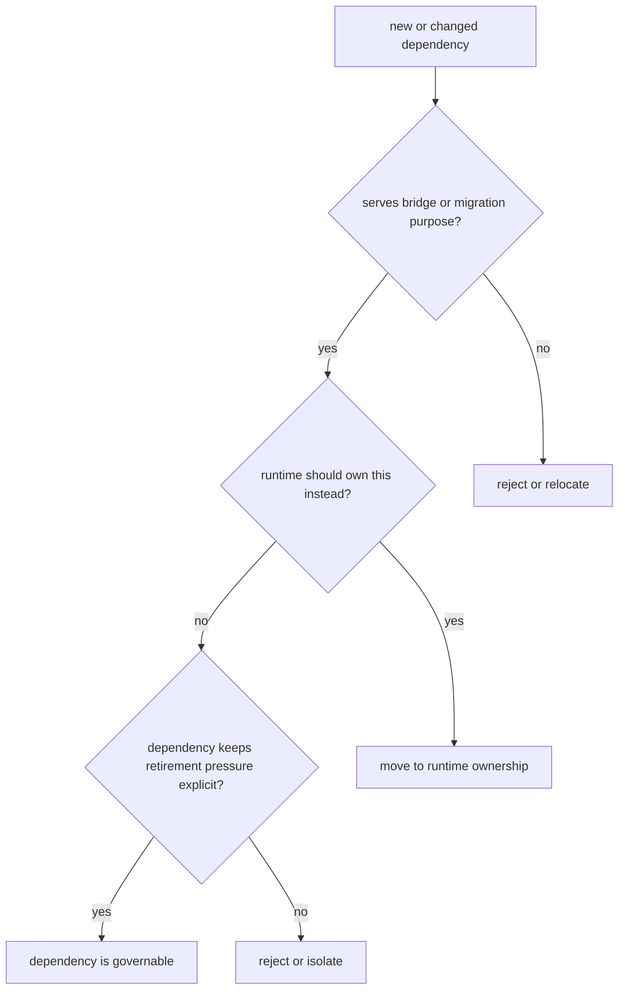

# Dependency Governance

Dependency governance is really boundary governance under another name.

For `agentic-proteins`, a dependency is acceptable only when it supports compatibility proof or retirement work without binding modern runtime ownership more tightly to the bridge.

## Governance Model

This page should stop the legacy bridge from accreting modern concerns by convenience. A dependency that makes the bridge feel more central is usually a dependency in the wrong place.

## Review Rules

- new dependencies need migration or compatibility justification
- avoid binding modern packages more tightly to the legacy bridge
- prefer runtime-owned solutions when a new dependency is really about execution

## First Proof Check

- `packages/agentic-proteins/tests`
- `src/agentic_proteins/interfaces/cli.py` and `interfaces/http/app.py`
- `src/agentic_proteins/execution/` and `src/agentic_proteins/state/`

## Design Pressure

The common drift is to accept a helper dependency that makes the bridge easier to extend today and harder to retire tomorrow.
