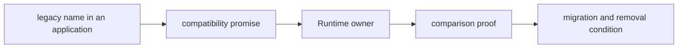

# Documentation standards

Public compatibility guidance must let an existing caller answer three
questions without reading implementation history: what still works, which
Runtime surface owns the behavior, and what must change before the bridge can
be removed.

## Required claim shape

| Public statement | Required context | Misleading form |
| --- | --- | --- |
| “supported” | named legacy surface, canonical destination, and tested behavior | implying new development should start on the bridge |
| “equivalent” | observable fields or object identity and the comparison test | treating similar output as full semantic parity |
| “deprecated” or “retiring” | remaining callers, migration route, and removal condition | announcing removal without measurable exit evidence |
| “provider available” | dependency extra, isolation boundary, and failure behavior | implying every installation can use the provider |
| “run succeeded” | terminal state, retained artifacts, and warnings or refusals | reducing success to a zero exit code |

## Reader route

Examples begin with a real legacy import, CLI command, or HTTP request and end
at the corresponding Runtime surface. They identify differences explicitly;
they do not present two equivalent-looking tutorials that force the reader to
infer ownership.

Use Runtime terminology for agents, tools, providers, runs, state, and
artifacts. Use bridge terminology only for forwarding, caller compatibility,
migration, and retirement. A bridge path may expose a concept without becoming
the authority for that concept.

## Evidence references

Claims about forwarding point to the relevant package contract tests. Claims
about CLI or HTTP behavior point to interface tests. Provider statements name
the required extra and negative-path evidence. Retirement statements point to
the compatibility contract and caller inventory rather than a date or vague
future intent.

The [compatibility contract](../foundation/compatibility-contract.md) owns the
public promise. [Known limitations](known-limitations.md) bounds its present
coverage, and [definition of done](definition-of-done.md) states what must be
true after a change.
