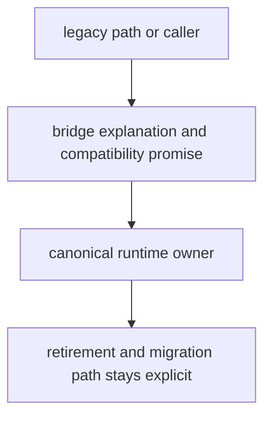

# Documentation Standards

Documentation standards should protect the reader from filler, drift, and false confidence.

For `agentic-proteins`, documentation should treat the package as a compatibility bridge, point readers toward canonical runtime ownership, and keep retirement language concrete.

## Documentation Model

This page should keep the bridge docs from sounding like a product center. Good documentation here teaches readers where the real owner lives and how the old path is supposed to disappear.

## Review Rules

- docs should treat the package as a compatibility bridge, not a product center
- examples should point readers toward canonical runtime ownership
- retirement and migration language must stay concrete

## First Proof Check

- `packages/agentic-proteins/tests`
- `src/agentic_proteins/interfaces/cli.py` and `interfaces/http/app.py`
- `src/agentic_proteins/execution/` and `src/agentic_proteins/state/`

## Design Pressure

The easy failure is to document the bridge so generously that readers stop feeling the pull toward the canonical runtime surface.
