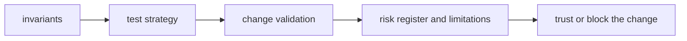
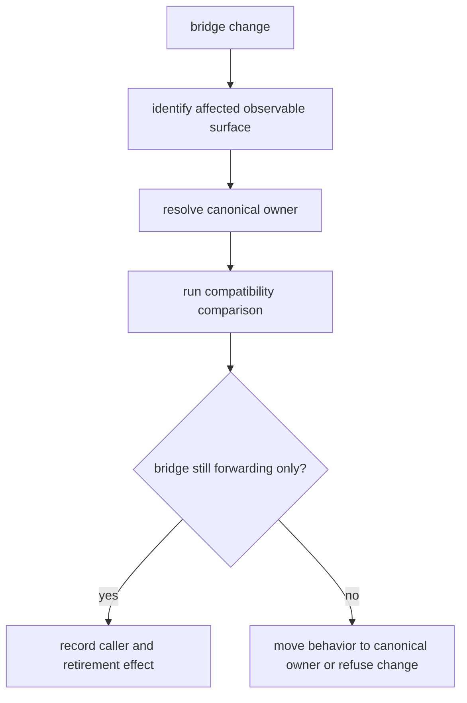

# Quality

Quality for `agentic-proteins` is compatibility evidence plus retirement
discipline. A change is acceptable only when existing callers retain their
declared observable behavior and the bridge does not regain product ownership.

## Trust Model

The bridge is trusted for forwarding, not for independent behavior. Import,
CLI, HTTP, state, and replay contracts are checked against canonical owners;
new scientific or execution behavior belongs in those owners first.

## Compatibility proof by surface

| Surface | Evidence required | Blocking failure |
| --- | --- | --- |
| Python imports | legacy symbol resolves to the declared canonical owner with equivalent public type and failure behavior | bridge defines or mutates product behavior |
| CLI | arguments, exit status, stdout or stderr contract, and artifacts match the canonical command | wrapper accepts an unsupported option or hides a canonical failure |
| HTTP | route, schema, status, and error envelope match the canonical application | bridge exposes an independently evolving protocol |
| persisted state | supported historical records reopen through a declared compatibility path | migration guesses at unknown state or loses lineage |
| replay | stable fields match under a named comparison policy | ignored divergence has no explicit normalization rule |
| retirement | caller inventory, replacement route, and absence test are current | a path is removed from memory rather than evidence |

## Start With

- open [Invariants](https://bijux.io/bijux-proteomics/02-agentic-proteins/quality/invariants/) before changing package meaning
- open [Change Validation](https://bijux.io/bijux-proteomics/02-agentic-proteins/quality/change-validation/) when you need the minimum proof for a real edit
- open [Risk Register](https://bijux.io/bijux-proteomics/02-agentic-proteins/quality/risk-register/) when the package boundary feels under pressure

## Section Pages

- [Invariants](https://bijux.io/bijux-proteomics/02-agentic-proteins/quality/invariants/)
- [Test Strategy](https://bijux.io/bijux-proteomics/02-agentic-proteins/quality/test-strategy/)
- [Change Validation](https://bijux.io/bijux-proteomics/02-agentic-proteins/quality/change-validation/)
- [Definition of Done](https://bijux.io/bijux-proteomics/02-agentic-proteins/quality/definition-of-done/)
- [Dependency Governance](https://bijux.io/bijux-proteomics/02-agentic-proteins/quality/dependency-governance/)
- [Documentation Standards](https://bijux.io/bijux-proteomics/02-agentic-proteins/quality/documentation-standards/)
- [Known Limitations](https://bijux.io/bijux-proteomics/02-agentic-proteins/quality/known-limitations/)
- [Review Checklist](https://bijux.io/bijux-proteomics/02-agentic-proteins/quality/review-checklist/)
- [Risk Register](https://bijux.io/bijux-proteomics/02-agentic-proteins/quality/risk-register/)

## First proof route

1. Identify the canonical owner in the migration ledger.
2. Run the surface-specific compatibility tests under
   `packages/agentic-proteins/tests`.
3. Inspect forwarding in `src/agentic_proteins/interfaces/`, `execution/`, or
   `state/` and confirm it introduces no independent policy.
4. Record whether the caller inventory shrinks, stays bounded, or expands.
5. Block any change that expands ownership without an explicit canonical
   package change.

## Design Pressure

The highest-risk failure is a green compatibility test around behavior that
now belongs only to the bridge. Parity is insufficient when ownership has
already drifted.
