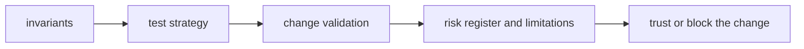

# Quality

`agentic-proteins` quality should tell a reviewer what must remain true, what proof is required, and which risks are serious enough to block a change.

## Trust Model

This page should show quality as a trust path rather than a page list. For the
legacy bridge package, trust means proving the bridge still forwards correctly
and stays easier to retire instead of becoming a second product surface.

## Start With

- open [Invariants](https://bijux.io/bijux-proteomics/02-agentic-proteins/quality/invariants/) before changing package meaning
- open [Change Validation](https://bijux.io/bijux-proteomics/02-agentic-proteins/quality/change-validation/) when you need the minimum proof for a real edit
- open [Risk Register](https://bijux.io/bijux-proteomics/02-agentic-proteins/quality/risk-register/) when the package boundary feels under pressure

## Section Pages

- [Invariants](https://bijux.io/bijux-proteomics/02-agentic-proteins/quality/invariants/)
- [Test Strategy](https://bijux.io/bijux-proteomics/02-agentic-proteins/quality/test-strategy/)
- [Change Validation](https://bijux.io/bijux-proteomics/02-agentic-proteins/quality/change-validation/)
- [Definition of Done](https://bijux.io/bijux-proteomics/02-agentic-proteins/quality/definition-of-done/)
- [Dependency Governance](https://bijux.io/bijux-proteomics/02-agentic-proteins/quality/dependency-governance/)
- [Documentation Standards](https://bijux.io/bijux-proteomics/02-agentic-proteins/quality/documentation-standards/)
- [Known Limitations](https://bijux.io/bijux-proteomics/02-agentic-proteins/quality/known-limitations/)
- [Review Checklist](https://bijux.io/bijux-proteomics/02-agentic-proteins/quality/review-checklist/)
- [Risk Register](https://bijux.io/bijux-proteomics/02-agentic-proteins/quality/risk-register/)

## What Quality Means Here

- proving that the legacy bridge still forwards correctly and becomes easier to retire over time

## First Proof Check

- `packages/agentic-proteins/tests`
- `src/agentic_proteins/interfaces/cli.py` and `api/app.py`
- `src/agentic_proteins/runtime/`

## Design Pressure

If the quality section reads like generic reassurance instead of a concrete
bridge-proof path, the legacy package will linger on habit instead of staying
reviewable and intentionally temporary.
