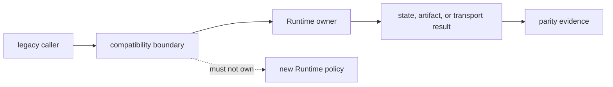

# Invariants

`agentic-proteins` is trustworthy only while it preserves established callers
without creating an independent owner for Runtime behavior. These invariants
apply to imports, transports, orchestration aliases, providers, state, and
artifacts.

## Compatibility invariants

| Invariant | Observable violation | Protecting evidence |
| --- | --- | --- |
| canonical ownership | a bridge module defines new run, state, tool, provider, or artifact policy | forwarding contracts and import-boundary tests |
| top-level identity | a promised export is copied or wrapped when object identity is part of compatibility | Runtime forwarding identity tests |
| behavioral parity | identical supported requests produce unexplained state, artifact, error, or transport differences | bridge-to-Runtime comparison tests |
| failure fidelity | Runtime refusal, failure, warning, or unavailable-provider state becomes fallback success | negative CLI, HTTP, provider, and run tests |
| artifact fidelity | bridge output drops provenance, terminal state, warnings, or stable identifiers | artifact-first and run-invariant tests |
| optional isolation | importing the base package activates or requires optional local or remote providers | provider isolation and disabled-dependency tests |
| migration visibility | a legacy path lacks a named canonical destination or measurable removal condition | bridge contract and retirement-budget tests |
| no new dependency direction | Runtime or another canonical package begins depending on the bridge | package import-boundary tests |

## Interpretation

Identity and behavioral parity are different guarantees. Identity is relevant
for forwarded Python objects. Behavioral parity is relevant for CLI, HTTP,
provider, execution, and serialization paths. Neither guarantee establishes
scientific validity of the returned result.

Historical breadth is not itself an invariant. Agents, tools, providers,
execution, orchestration, and transport paths may be narrowed when caller and
retirement evidence permits. The invariant is that narrowing is deliberate and
that remaining callers retain the declared contract.

## When an invariant fails

Treat divergence as a compatibility defect or an ownership defect. Record the
exact path, Runtime comparison, affected caller, and retained output. Do not
normalize the difference away in the bridge or document it as a second valid
policy without changing canonical ownership.
