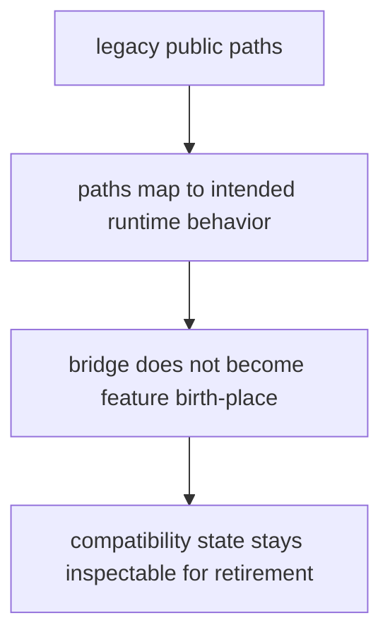

# Invariants

Invariants are the claims that must remain true for the package to stay worth trusting.

For `agentic-proteins`, the invariants are mostly about keeping legacy compatibility narrow, inspectable, and pointed at canonical runtime behavior.

## Invariant Model

This page should make it obvious that the bridge is trustworthy only while it stays thin and inspectable. If new strategy starts here, the invariant has already broken.

## Review Rules

- legacy public paths must still map to the intended canonical runtime behavior
- the bridge must not become the place where new strategic features are born
- compatibility state and artifacts must stay inspectable enough to justify retirement later

## First Proof Check

- `packages/agentic-proteins/tests`
- `src/agentic_proteins/interfaces/cli.py` and `api/app.py`
- `src/agentic_proteins/runtime/`

## Design Pressure

The easy mistake is to protect compatibility while quietly letting the bridge become the place where new product behavior begins.
