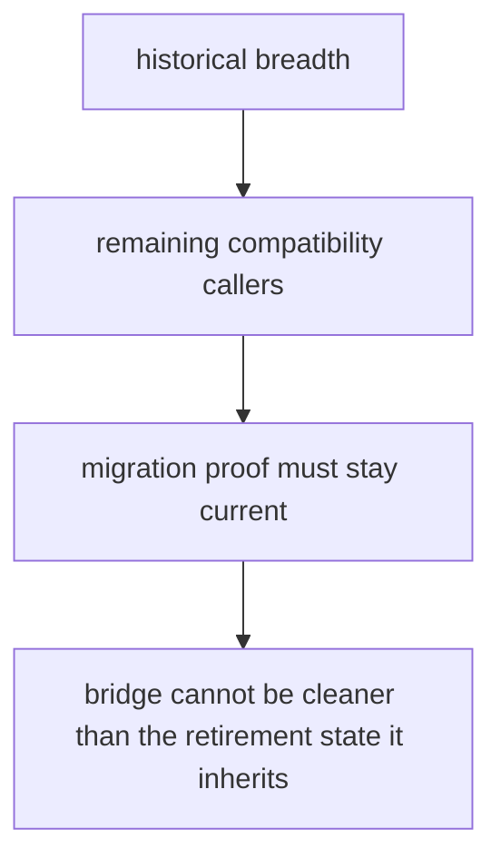

# Known Limitations

Known limitations matter because honest boundaries are part of quality, not an admission of failure.

For `agentic-proteins`, the main limitations come from history: the bridge is broader than ideal, some compatibility paths still exist, and trust depends on keeping migration proof current.

## Limitation Model

This page should keep the bridge honest about what it cannot promise. The package can forward legacy paths responsibly, but it cannot pretend history left it with a perfectly narrow surface.

## Review Rules

- the package is broad because history left it that way, not because that breadth is ideal
- some compatibility behavior remains until downstream callers are retired
- the bridge can only be trusted as far as its migration proof stays current

## First Proof Check

- `packages/agentic-proteins/tests`
- `src/agentic_proteins/interfaces/cli.py` and `interfaces/http/app.py`
- `src/agentic_proteins/execution/` and `src/agentic_proteins/state/`

## Design Pressure

The dangerous illusion is to talk about the bridge as if it were already as small and temporary as the long-term design wants it to be.
