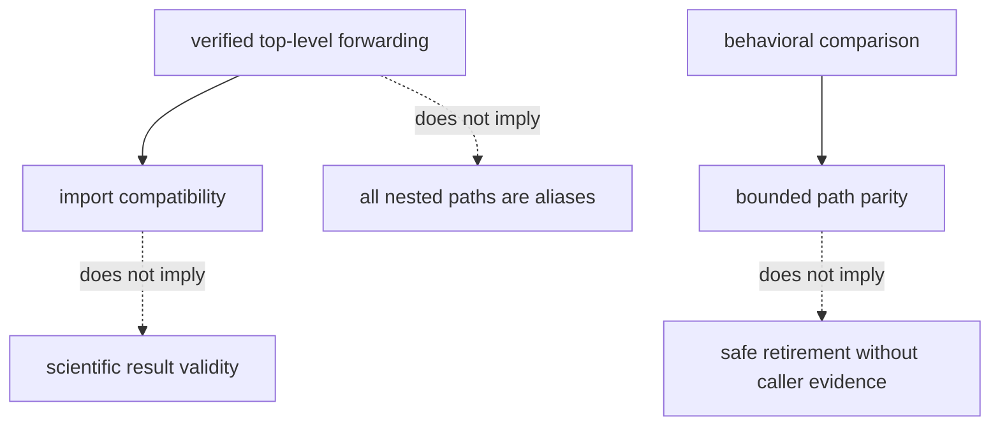

# Known limitations

`agentic-proteins` preserves a historically broad caller surface. Its
compatibility value is real, but it is not evidence that the bridge is already
thin, that every path is a direct alias, or that new integrations should use
it.

## Current limits

| Limitation | Consequence | Responsible interpretation |
| --- | --- | --- |
| the source tree contains legacy agents, providers, tools, state, execution, orchestration, CLI, and HTTP paths | compatibility spans more than a single import facade | inspect the exact path; do not infer whole-package equivalence from one forwarding test |
| top-level Runtime exports are identity-tested, but nested historical paths have different proof | one verified alias does not establish every nested module as a pure alias | require path-specific comparison evidence |
| `execution` and `orchestration` both remain visible | similar names can obscure which surface is canonical | treat Runtime as owner and consult bridge contracts before extending either path |
| optional local and remote providers depend on external systems and extras | availability, latency, failure, and reproducibility vary by environment | record provider, version, configuration, and failure outcome |
| CLI and HTTP compatibility preserve transport obligations | transport success does not prove scientific validity of a result | inspect run state, artifacts, warnings, and downstream scientific evidence |
| retirement depends on downstream callers | repository-local green tests cannot prove that no external consumer remains | keep caller and removal evidence explicit |

## Proof boundary

A successful bridge call says that the tested compatibility route completed
under the recorded conditions. It does not say that an optional provider was
available everywhere, that every artifact has equivalent scientific meaning,
or that the corresponding legacy surface can be removed.

## How to report a gap

Name the precise path and missing proof: for example, “top-level `RunManager`
identity is verified; nested HTTP error parity was not evaluated.” Avoid
package-wide phrases such as “fully equivalent” unless every public surface,
negative path, and retained artifact in that claim has direct evidence.

The durable destination is [Bijux Proteomics Runtime](../../09-bijux-proteomics-runtime/index.md).
The bridge remains supported only within the explicit
[compatibility contract](../foundation/compatibility-contract.md).
