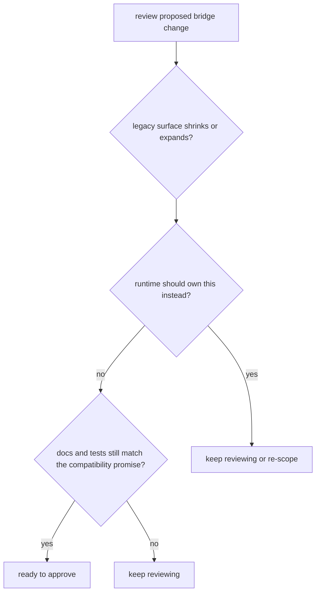

# Review Checklist

A review checklist is useful only if it catches the real ways this package can drift.

For `agentic-proteins`, review should ask whether a change shrinks or expands legacy surface area and whether runtime already owns the better place for the behavior.

## Review Model

This checklist should catch the moment a small bridge edit starts behaving like product growth instead of compatibility stewardship.

## Review Rules

- ask whether the change shrinks or expands legacy surface area
- check whether runtime already owns the better place for the behavior
- verify that public docs and tests still agree on the compatibility promise

## First Proof Check

- `packages/agentic-proteins/tests`
- `src/agentic_proteins/interfaces/cli.py` and `interfaces/http/app.py`
- `src/agentic_proteins/execution/` and `src/agentic_proteins/state/`

## Design Pressure

The easy failure is to approve a clean local diff without noticing that the bridge just claimed a broader long-term obligation.
