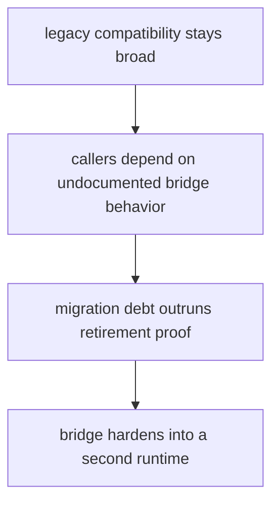

# Risk Register

A risk register should name the structural and behavioral failures that deserve ongoing attention.

For `agentic-proteins`, the structural risks are the ones that turn a temporary bridge into a second permanent runtime surface.

## Risk Model

This page should keep the danger chain visible. The serious risk is not one isolated failing path; it is the gradual hardening of the bridge into something the system no longer knows how to retire.

## Review Rules

- legacy compatibility hardens into a second permanent runtime
- callers depend on undocumented bridge behavior
- migration debt grows faster than retirement proof

## First Proof Check

- `packages/agentic-proteins/tests`
- `src/agentic_proteins/interfaces/cli.py` and `api/app.py`
- `src/agentic_proteins/runtime/`

## Design Pressure

The common drift is to track breakages one by one while missing the higher-order risk that the bridge is becoming permanent by habit.
